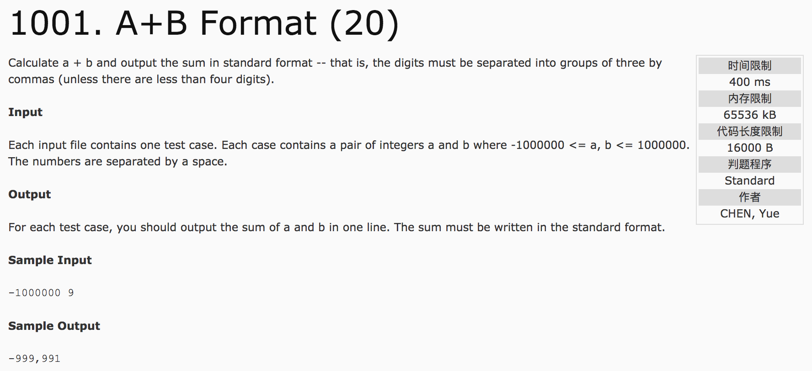

## A + B Format(20)



分析：字符串处理。由整型数字转字符串输出。

```c++
int result, s[n], t = 0;
if(result < 0)
  result *= (-1);
while(result) {
  s[t++] = result % 10;
  result /= 10;
}
for(int i = t - 1; i >= 0; i--)
  cout << s[i];
```

c++代码：

```c++
#include <iostream>
using namespace std;
int main() {
  int a, b, result, t = 0;
  cin >> a >> b;
  result = a + b;
  if(result == 0){
    cout << 0;
    return 0;
  }
  if(result < 0) {
    cout << "-";
    result = result * (-1);
  }
  int s[7];
  while(result) {
    s[t++] = result % 10;
    result /= 10;
  }
  int count = t;
  for(int i = t - 1; i >= 0; i--) {
    cout << s[i];
    count--;
    if(count % 3 == 0 && count != 0)
      cout << ",";
  }
  return 0;
}
```
