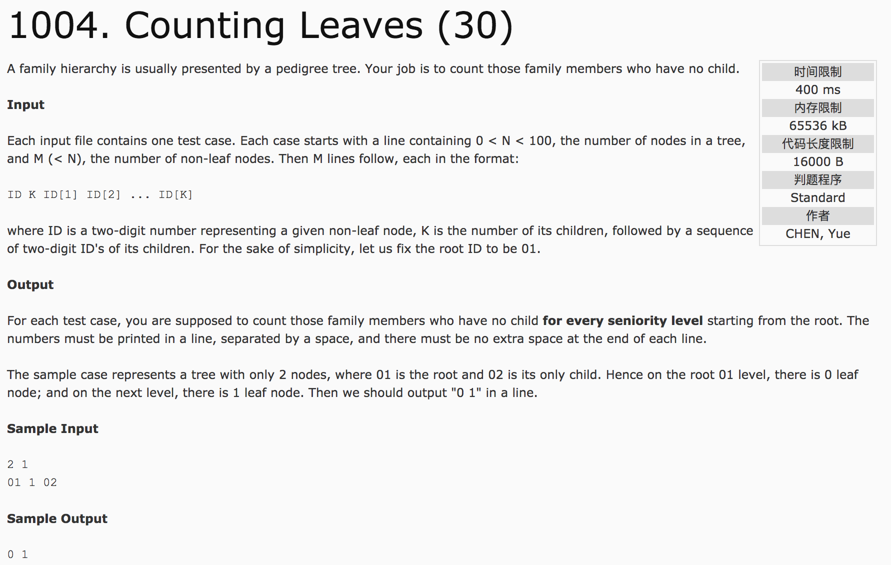

## Counting Leaves（30）



题意：求家庭谱系树中没有孩子的家庭数量。

题解：搜索树的每层叶子节点。给出树中总节点个数N，非叶节点的数目M及其子节点。根节点ID为01。求每层没有叶子节点的节点数量，且空格隔开，序列的最后没有空格。

思路：使用深度优先搜索或者广度优先搜索

### 深度优先搜索DFS

每个节点包含的信息包括**当前节点**和其**子节点**。当其子节点个数(度)为0时，可判定为叶子节点。因此，可以考虑使用vector对象。

```
#include <cstdio>
#include <vector>
#include <algorithm>
using namespace std;
vector<int> v[100];
int book[100], maxdepth = -1;
void dfs(int index, int depth) {
  if(v[index].size() == 0) {
    book[depth]++;
    maxdepth = max(maxdepth, depth);
    return ;
  }
  for(int i = 0; i < v[index].size(); i++)
    dfs(v[index][i], depth + 1);
}
int main() {
  int n, m, k, node, c;
  scanf("%d %d", &n, &m);
  for(int i = 0; i < m; i++) {
    scanf("%d %d", &node, &k);
    for(int j = 0; j < k; j++) {
      scanf("%d", &c);
      v[node].push_back(c);
    }
  }
  dfs(1,0);
  printf("%d", book[0]);
  for(int i = 1; i <= maxdepth; i++)
    printf(" %d", book[i]);
  return 0;
}
```

## 广度优先搜索

```
//c++代码实现
# define NUM 30
vector<int> v[NUM];
int level[NUM];  //用于存放每个节点的层数
int book[NUM];  //用于存放每层的叶子节点个数
maxlevel = -1;  //度
void bfs() {
  queue <int> q;
  q.push(1);
  level[1] = 0;
  while(!q.empty()) {
    int index = q.front();  //取得队头元素
    q.pop();  //删除队头元素
    maxlevel = max(level[index], maxlevel);
    if(v[index].size() == 0)
      book[level[index]]++;  //度为0，叶子节点加1
    for(int i = 0; i < v[index].size(); i++) {
      q.push(v[index][i]);  //子节点压入队列
      level[v[index][i]] = level[index] + 1;  //节点层数加1
    }
  }
}
```
