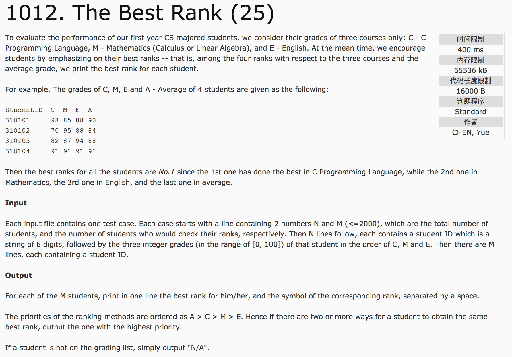
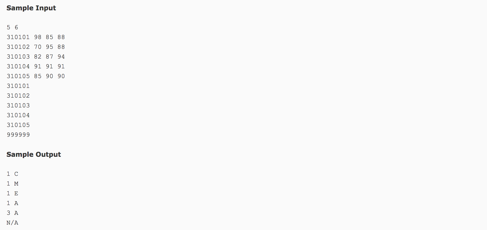

## The Best Rank(25)




题意：每个学生都有三门功课C,M,E以及三门功课的平均成绩A。因此，每个学生拥有四个不同的排名，排名的优先级是A>C>M>E。

分析：1.用结构体存储学生的id、四门成绩、四门排名、最好的排名的对应的科目下标   
2.注意，排名并列应该1、1、3、4、5，而不是1、1、2、3、4，否则会有一个测试点不过   
3.注意，平均分是四舍五入的，所以需要按照+0.5后取整，保证是四舍五入的（听说不四舍五入也能通过…）  
4.存储的时候就按照ACME的顺序存储可以简化程序逻辑   
5.用exist数组保存当前id是否存在，这个id对应的stu结构体的下标是多少。用i+1可以保证为0的都是不存在的可以直接输出N/A，其余不为0的保存的值是对应的结构体index + 1的值  
c++代码：

```
#include <cstdio>
#include <algorithm>
using namespace std;
struct node {
    int id, best;
    int score[4], rank[4];
}stu[2002];
int exist[1000000], flag = -1;
bool cmp1(node a, node b) {return a.score[flag] > b.score[flag];}
int main() {
    int n, m, id;
    scanf("%d %d", &n, &m);
    for(int i = 0; i < n; i++) {
        scanf("%d %d %d %d", &stu[i].id, &stu[i].score[1], &stu[i].score[2], &stu[i].score[3]);
        stu[i].score[0] = (stu[i].score[1] + stu[i].score[2] + stu[i].score[3]) / 3.0 + 0.5;
    }
    //对成绩进行排序，标注名次
    for(flag = 0; flag <= 3; flag++) {
        sort(stu, stu + n, cmp1);   //降序排列
        stu[0].rank[flag] = 1;
        for(int i = 1; i < n; i++) {
            stu[i].rank[flag] = i + 1;
            if(stu[i].score[flag] == stu[i-1].score[flag])
                stu[i].rank[flag] = stu[i-1].rank[flag];
        }
    }

    for(int i = 0; i < n; i++) {
        exist[stu[i].id] = i + 1;
        stu[i].best = 0;
        //查找最好的成绩学科，存入best
        int minn = stu[i].rank[0];
        for(int j = 1; j <= 3; j++) {
            if(stu[i].rank[j] < minn) {
                minn = stu[i].rank[j];
                stu[i].best = j;
            }
        }
    }
    char c[5] = {'A', 'C', 'M', 'E'};
    for(int i = 0; i < m; i++) {
        scanf("%d", &id);
        int temp = exist[id];
        if(temp) {
            int best = stu[temp-1].best;
            printf("%d %c\n", stu[temp-1].rank[best], c[best]);
        } else {
            printf("N/A\n");
        }
    }
    return 0;
}
```
