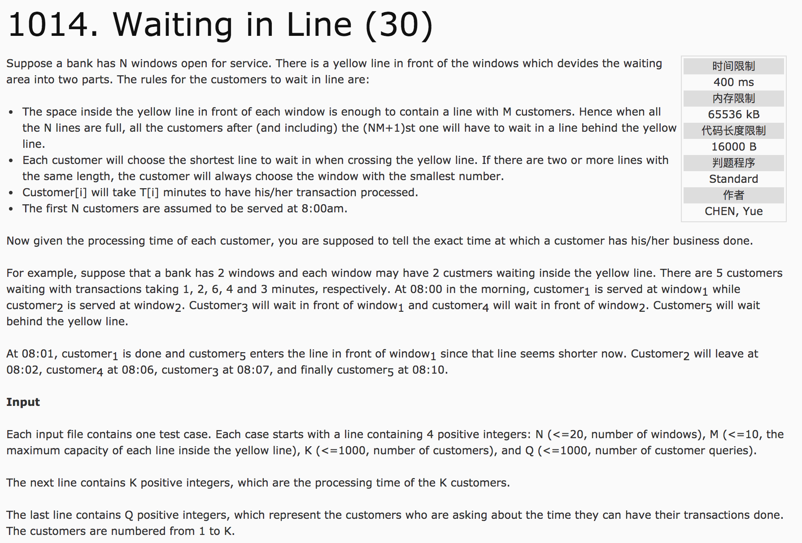
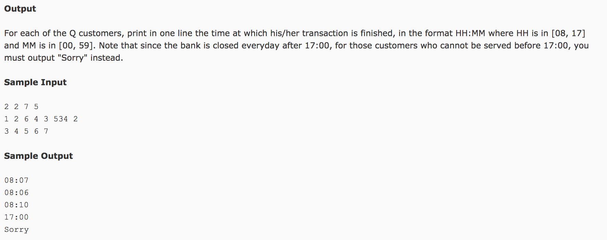

## Waiting in Line(30)




题意：银行有N个窗口，每个窗口可以允许M个客户排队等候。当客户数量超过NM个时，新来的客户选择窗口队伍较短的进行领队，队伍等长时，选窗口序号较小的进行排队。已知每个客户的业务办理时长，已知窗口数N，队列的长度M，客户数K（从1至K)，以及每个客户的业务办理时长，求每个客户的业务办理结束时间。银行业务时间08：00-17：00，如超过17：00，客户的业务未被办理，则输出"Sorry"。

分析：**queue的应用**。设计结构体，包含poptime表示队首的人出队时间（即，队首服务结束的时间，poptime最小的一队即是后续人员排队的队列），endtime表示队尾的人的服务结束时间（当endtime大于17:00时，后面的人将会被Sorry）。

1) 用result[n + 1](int)和sorry[n + 1](bool)存储每个客户的结束的信息。

2）窗口结构体的设计。

```c++
struct WINDOW {
  int poptime;     //存储队头出队的时间，用于判断新来客户应该进入的窗口号
  int endtime;     //存储队尾结束服务的时间
  queue<int> q;    //用户存储排队的客户时间信息
};
```

3) 数据的处理：先进行初始化，而后进行判断条件，之后再进行数据的更新。例如：

```c++
for(int i = 1; i <= m; i++) {
  for(int j = 1; j <= n; j++) {
    if(index <= k) {
      if(i == 1)  //初始化
        window[j].poptime = window[j].endtime;
      //条件判断
      if(window[j].endtime >= 540)
        sorry[index] = true;
      //数据更新
      window[j].q.push(time[index]);
      window[j].endtime += time[index];
      result[index] = window[j].endtime;
      index++;
    }
  }
}
while(index <= k) {
  int tempwindow = 1, minwindowtime = window[i].poptime;
  //判断，初始化
  for(int i = 2; i <= n; i++) {
    if(window[i].poptime < minwindowtime) {
      tempwindow = i;
      minwindowtime = window[i].poptime;
    }
  }
  window[tempwindow].q.pop();
  window[tempwindow].q.push(time[index]);
  window[tempwindow].poptime += window[tempwindow].q.front();
  if(window[tempwindow].endtime >= 540)
    sorry[index] = true;
  window[tempwindow].endtime += time[index];
  result[index] = window[tempwindow].endtime;
  index++;
}
```

c++代码：

```c++
#include <cstdio>
#include <queue>
#include <vector>
using namespace std;
struct node {
  int poptime;
  int endtime;
  queue<int> q;
};
int main() {
  int n, m, k, q;
  scanf("%d %d %d %d", &n, &m, &k, &q);
  vector<int> time(k + 1), result(k + 1);
  for(int i = 1; i <= k; i++)
    scanf("%d", &time[i]);
  vector<node> window(n + 1);
  vector<bool> sorry(k + 1, false);
  int index = 1;
  //第一步，先填充N * M
  for(int i = 1; i <= m; i++) {    //队列长度，视为行
    for(int j = 1; j <= n; j++) {  //窗口数，视为列
      if(index <= k) {
        //起始值
        if(i == 1)
          window[j].poptime = window[j].endtime;
        //将时间值压入队列
        window[j].q.push(time[index]);
        if(window[j].endtime >= 540)
          sorry[index] = true;
        //计算endtime
        window[j].endtime += time[index];
        result[index] = window[j].endtime;
        index++;
      }
    }
  }
  //第二步，处理超出部分
  while(index <= k) {
    int tempmin = window[1].poptime, tempwindow = 1;
    //选取poptime最小的窗口
    for(int i = 2; i <= n; i++) {
      if(window[i].poptime < tempmin) {
        tempwindow = i;
        tempmin = window[i].poptime;
      }
    }
    //最小窗口，队头出列
    window[tempwindow].q.pop();   //队头出列
    window[tempwindow].q.push(time[index]);  //新值入队
    window[tempwindow].poptime += window[tempwindow].q.front();  //更新poptime
    if(window[tempwindow].endtime >= 540)
      sorry[index] = true;
    window[tempwindow].endtime += time[index];  //更新endtime
    result[index] = window[tempwindow].endtime;
    index++;
  }
  for(int i = 1; i <= q; i++) {
    int query, minute;
    scanf("%d", &query);
    minute = result[query];
    if(sorry[query] == true)
      printf("Sorry\n");
    else
      printf("%02d:%02d\n",(minute + 480) / 60, (minute + 480) % 60);
  }
  return 0;
}
```
