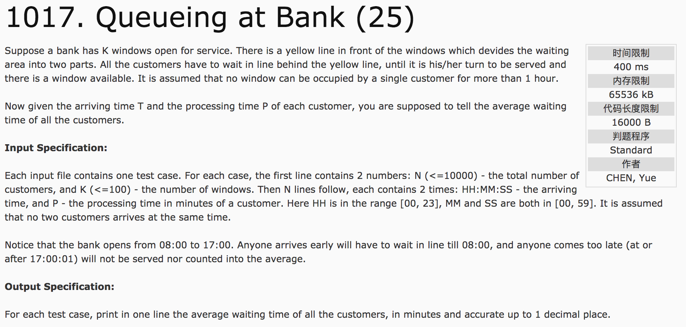
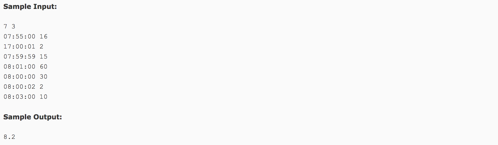

## Queueing at Back(25)




题意：银行有K个窗口可供服务和N个客户，已知每个客户的到达时间T和被服务时间P，求 **每个客户的等待时间**。假定窗口服务单个客户的时间不能超过1小时（也就是说，超过1小时的将被压缩至1小时）。银行服务时间是08:00:00-17:00:00，早于08:00:00的客户需要等待，晚于17:00:00不被服务。

分析：首先筛选有效数据（到达时间在17:00:00及之前）并排序，之后按 **先到先服务的原则**。设定客户结构体node，存储达到时间come和服务时间time。设定window数组为每个窗口结束服务的时间（初始值设为08:00:00），如果客户到达时间小于等于window时间，则直接被服务，若大于window时间则需要等待，记录等待时间，服务结束后更新window值。为了便于比较，可将所有的时间折算成秒。**如果一个客户都没有，需要输出0.0。**

c++代码

```
#include <cstdio>
#include <vector>
#include <algorithm>
using namespace std;
struct node {
  int come;
  int time;
}tempcustomer;
bool cmp1(node a, node b) {
  return a.come < b.come;
}
int main() {
  int n, k;
  int HH, MM, SS, m;
  scanf("%d %d", &n, &k);
  vector<node> customer;
  for(int i = 0; i < n; i++) {
    scanf("%d:%d:%d %d", &HH, &MM, &SS, &m);
    if(m > 60) m = 60;  //当处理时间大于60min时，按60min处理
    int cometime = HH * 3600 + MM * 60 + SS;
    //存储有效数据
    if(cometime > 61200)
      continue;
    tempcustomer.come = cometime;
    tempcustomer.time = m * 60;
    customer.push_back(tempcustomer);
  }
  //数据排序，即到达时间排序
  sort(customer.begin(), customer.end(), cmp1);
  vector<int> window(k, 28800);  //widow表示各窗口结束服务的时间
  double result = 0.0;
  for(int i = 0; i < customer.size(); i++) {
    //选取可提供服务的窗口
    int tempindex = 0, minfinish = window[0];
    for(int j = 1; j < k; j++) {
      if(window[j] < minfinish) {  //选取最早结束服务的窗口
        minfinish = window[j];
        tempindex = j;
      }
    }
    if(window[tempindex] <= customer[i].come) { //当窗口服务结束时间小于等于客户到达时间，则直接提供服务
      window[tempindex] = customer[i].come + customer[i].time;
    } else {
      result += (window[tempindex] - customer[i].come);
      window[tempindex] += customer[i].time;
    }
  }
  if(customer.size() == 0)
    printf("0.0");
  else
    printf("%.1f", result / 60.0 / customer.size());
  return 0;
}
```
