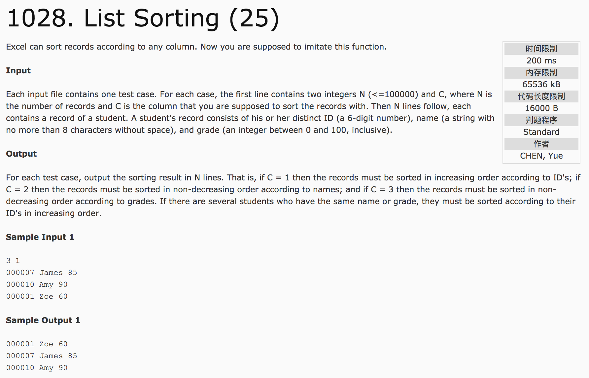
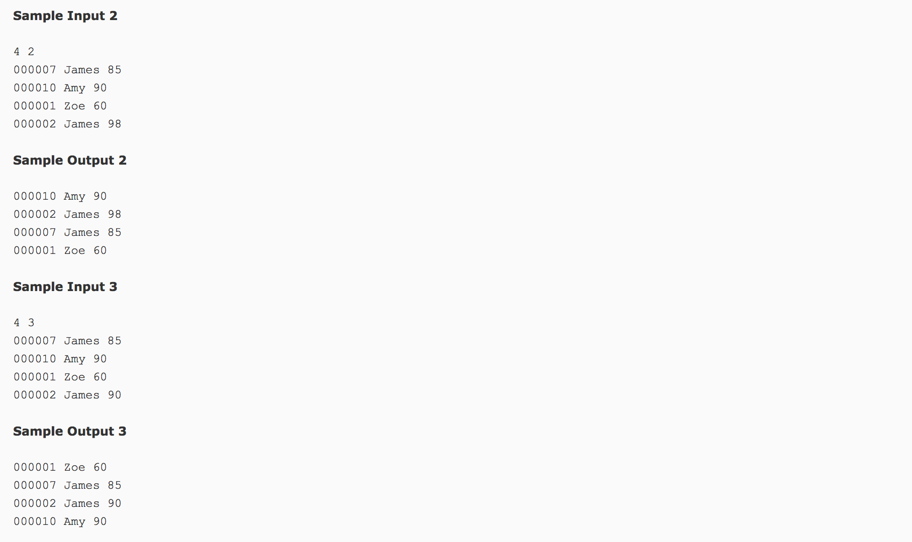

## List Sorting(25)




分析：字符串处理，vector的应用，比较函数

c++代码(subond):

```c++
#include <cstdio>
#include <iostream>
#include <vector>
#include <cstring>
#include <algorithm>
#include <string.h>
using namespace std;
struct node {
  int id;
  int grade;
  char name[10];
};
bool cmp1(node a, node b) {
  return a.id < b.id;
}
bool cmp2(node a, node b) {
  if(strcmp(a.name, b.name) == 0) {
    return a.id < b.id;
  } else {
    return strcmp(a.name, b.name) < 0;
  }
}
bool cmp3(node a, node b) {
  if(a.grade == b.grade)
    return a.id < b.id;
  else
    return a.grade < b.grade;
}
vector<node> v;
int main() {
  int n, c, id, grade;
  char name[10];
  scanf("%d %d", &n, &c);
  v.resize(n);
  for(int i = 0; i < n; i++) {
    cin >> id >> name >> grade;
    v[i].id = id;
    strcpy(v[i].name, name);
    v[i].grade = grade;
  }
  if(c == 1)
    sort(v.begin(), v.end(), cmp1);
  if(c == 2)
    sort(v.begin(), v.end(), cmp2);
  if(c == 3)
    sort(v.begin(), v.end(), cmp3);
  for(int i = 0; i < n; i++) {
    printf("%06d %s %d\n", v[i].id, v[i].name, v[i].grade);
  }
  return 0;
}
```
