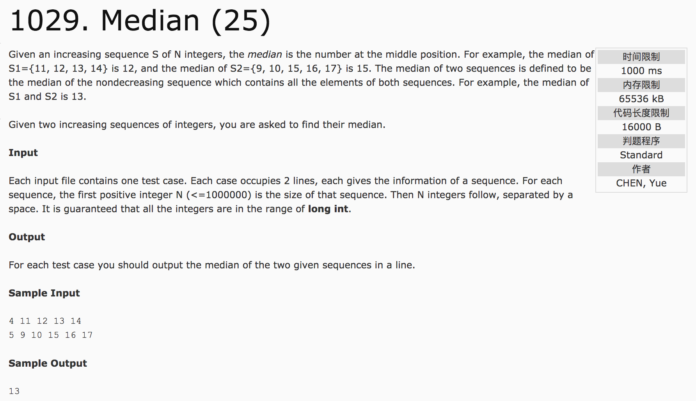

## Median(25)



c++代码(subond):

```c++
#include <cstdio>
#include <vector>
#include <algorithm>
using namespace std;
vector<int> v;
int main() {
  int n, m, temp, sum;
  scanf("%d", &n);
  for(int i = 0; i < n; i++) {
    scanf("%d", &temp);
    v.push_back(temp);
  }
  scanf("%d", &m);
  for(int i = 0; i < m; i++) {
    scanf("%d", &temp);
    v.push_back(temp);
  }
  sort(v.begin(), v.end());
  printf("%d", v[(v.size() - 1) >> 1]);
  return 0;
}
```
