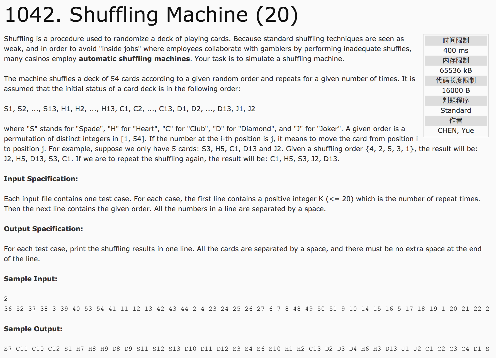

## Shuffling Machine(20)



题意：洗牌机。将当前位置的数字放到指定位置上去。

分析：1）为了计算方便，以1-54进行编号存储。经过变换后，输出时现将1-54降到0-53，则花色为(0-53) / 13，大小为(0-53) % 13 + 1。

2）用1-54的编号进行存储，方便变换。

c++代码：

```c++
#include <cstdio>
using namespace std;
int main() {
  int count;
  scanf("%d", &count);
  int start[55], end[55], scan[55];
  for(int i = 1; i <=54 ; i++) {
    scanf("%d", &scan[i]);
    end[i] = i;
  }
  for(int i = 0; i < count; i++) {
    for(int j = 1; j <= 54; j++) {
      start[j] = end[j];
    }
    for(int k = 1; k <= 54; k++) {
      end[scan[k]] = start[k];
    }
  }
  char c[6] = {"SHCDJ"};
  for(int i = 1; i <= 54; i++) {
    printf("%c%d", c[(end[i] - 1) / 13], (end[i] - 1) % 13 + 1);
    if(i != 54) printf(" ");
  }
  return 0;
}
```
