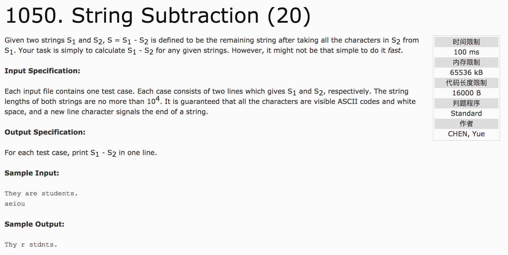

## String Subtraction(20)



题意：给定两个字符串，从第一个字符串s1中删除第二个字符串s2的所有字符，并输出。

分析：

1) 利用字符在ASCII中的位置，利用flag[128]进行标记，将s2中出现过的字符，在flag[128]数组中标记为true，否则为false。

2）利用flag输出s1。

c++代码：

```c++
#include <string>
#include <iostream>
#include <cstdio>
#include <string.h>
using namespace std;
char s1[10005], s2[10005];
int main() {
    cin.getline(s1, 10005);
    cin.getline(s2, 10005);
    int lens1 = strlen(s1);
    int lens2 = strlen(s2);
    bool flag[256] = {false};
    for(int i = 0; i < lens2; i++) {
        flag[s2[i]] = true;
    }
    for(int i = 0; i < lens1; i++) {
        if(!flag[s1[i]])
            printf("%c", s1[i]);
    }
    return 0;
}
```
