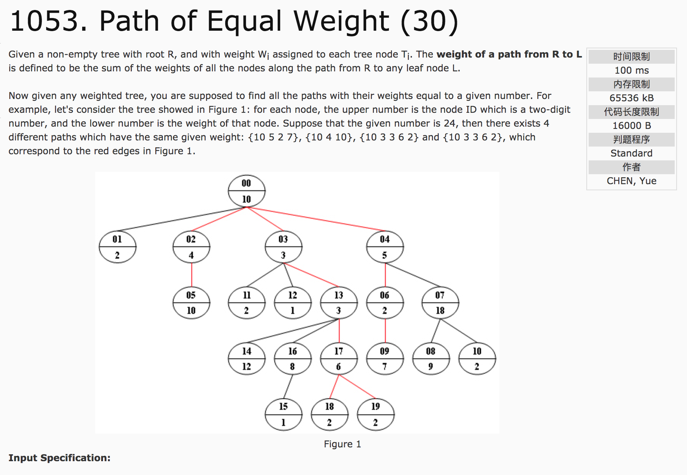
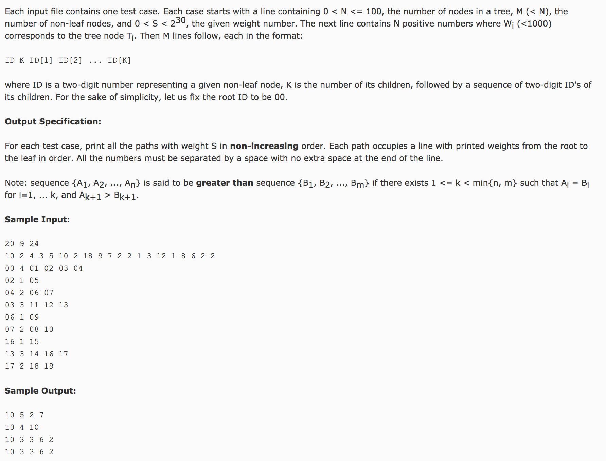

## Path of Equal Weight(30)




题意：给定树的结构和权值，找到中根结点到叶子结点的路径上权值相加之和等于指定数的路径。路径按照权值从小到大输出。

分析：

**当结果有输出顺序要求时，可以有两种做法：1）得到结果后进行进行顺序调整；2）在数据存储时调整顺序，让得到的结果可以直接输出。**

这一题中用了第2)种方法。将每一结点的子节点按照其权重进行排序，为了方便排序，使用vector<int>对象形式，并建立结点结构体。

当DFS算法的终止条件结束时，可以得到程序结果。可以考虑在DFS算法中输出结果。

```c++
#include <vector>
struct node {
  int w;
  vector<int> child;
};
vector<node> v;
v.resize(n);
bool cmp(int a, int b) {
  return v[a].w > v[b].w;
}
sort(v[index].child.begin(), v[index].child.end(), cmp);
```

c++代码：

```c++
#include <cstdio>
#include <vector>
#include <algorithm>
using namespace std;
int target;
struct NODE {
    int w;
    vector<int> child;
};
vector<NODE> v;
vector<int> path;
void dfs(int index, int nodeNum, int sum) {
    if(sum > target) return ;
    if(sum == target) {
        if(v[index].child.size() != 0) return;
        for(int i = 0; i < nodeNum; i++)
            printf("%d%c", v[path[i]].w, i != nodeNum - 1 ? ' ' : '\n');
        return ;
    }
    for(int i = 0; i < v[index].child.size(); i++) {
        int node = v[index].child[i];
        path[nodeNum] = node;
        dfs(node, nodeNum + 1, sum + v[node].w);
    }

}
int cmp1(int a, int b) {
    return v[a].w > v[b].w;
}
int main() {
    int n, m, node, k;
    scanf("%d %d %d", &n, &m, &target);
    v.resize(n), path.resize(n);
    for(int i = 0; i < n; i++)
        scanf("%d", &v[i].w);
    for(int i = 0; i < m; i++) {
        scanf("%d %d", &node, &k);
        v[node].child.resize(k);
        for(int j = 0; j < k; j++)
            scanf("%d", &v[node].child[j]);
        sort(v[node].child.begin(), v[node].child.end(), cmp1);
    }
    dfs(0, 1, v[0].w);
    return 0;
}
```
