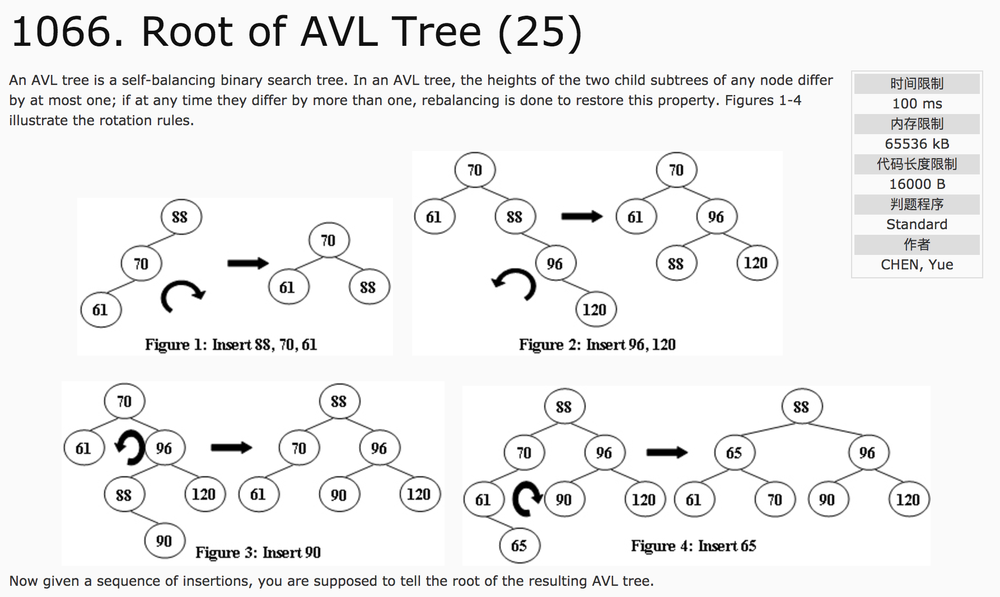
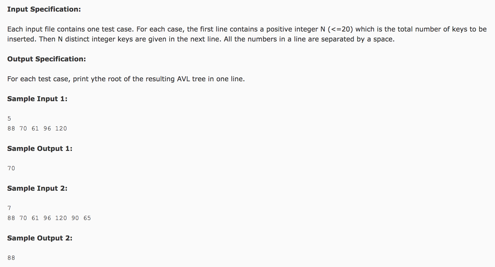

## Root of AVL Tree(25)




题意：输出AVL树的根结点。

分析：

1) 获取子树深度。

```c++
#include <cstdio>
using namespace std;
struct TREE {
  int value;
  struct TREE *left, *right;
};
int getHeight(TREE *tree) {
  if(tree == NULL) {
    return 0;
  } else {
    int l = getHeight(tree->left);
    int r = getHeight(tree->right);
    return l > r ? l + 1 : r + 1;
  }
}
```

2) 左右旋问题

```c++
#include <cstdio>
using namespace std;
struct TREE {
  int value;
  struct TREE *left, *right;
};
TREE *rightRotate(TREE *tree) {
  struct TREE *temp = tree->left;
  tree->left = temp->right;
  temp->right = tree;
  return temp;
}
TREE *leftRotate(TREE *tree) {
  struct TREE *temp = tree->right;
  tree->right = temp->left;
  temp->left = tree;
  return temp;
}
TREE *leftrightRotate(TREE *tree) {
  tree->left = leftRotate(tree->left);
  tree = rightRotate(tree);
  return tree;
}
TREE *rightleftRotate(TREE *tree) {
  tree->right = rightRotate(tree->right);
  tree = leftRotate(tree);
  return tree;
}
```

3）递归简历二叉搜索树。

```c++
#include <cstdio>
using namespace std;
struct TREE {
  int value;
  struct TREE *left, *right;
};
TREE* insert(TREE *tree, int value) {
  if(tree == NULL) {
    tree = new TREE();
    tree->value = value;
    tree->left = NULL;
    tree->right = NULL;
    return tree;
  }
  if(value <= tree->value) {
    tree->left = insert(tree->left, value);
    int l = getHeight(tree->left);
    int r = getHeight(tree->right);
    if(l - r >= 2) {
      if(value <= tree->left->value)
        tree = rightRotate(tree);
      else
        tree = leftrightRotate(tree);
    }
  }
  if(value > tree->value) {
    tree->right = insert(tree->right, value);
    int l = getHeight(tree->left);
    int r = getHeight(tree->right);
    if(r - l >= 2) {
      if(value <= tree->right->value)
        tree = rightleftRotate(tree);
      else
        tree = leftRotate(tree);
    }
  }
  return tree;
}
```
