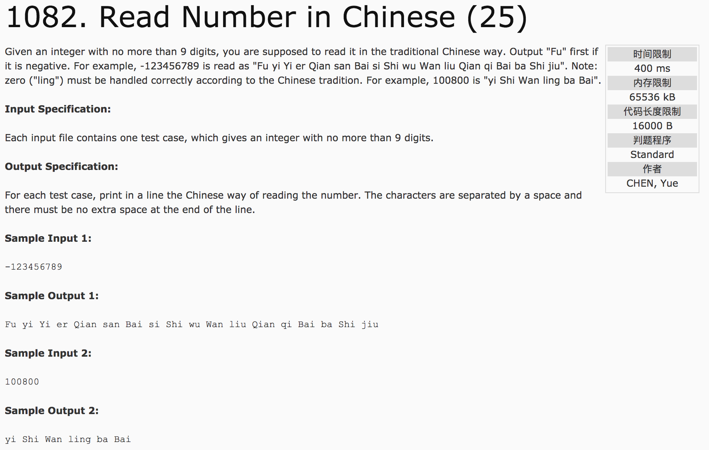

## Read Number in Chinese(25)



题意：给定一个不超过9位数的整型数，用中文的方式读出来。包括负号（Fu)，0（ling)以及数字位大小称号。

分析：

1. 四位四位的分离读取，根据read(number)中number的大小，添加Yi或Wan的标记。

c++代码：

```
#include <cstdio>
using namespace std;
char c[6][5] = {"Shi", "Bai", "Qian", "Wan", "Yi"};
char t[11][5] = {"ling", "yi", "er", "san", "si", "wu", "liu", "qi", "ba", "jiu"};
int a, flag = 0;  //flag用于表示是否需要空格
void read(int number) {
  //读四位数，并保证前后均为空格
  int flag1 = 0, flag2 = 0, flag3 = 3;
  //读取千位
  if(number / 1000) {
    printf("%s %s", t[number / 1000], c[2]);
    flag1 = 1;
  } else {
    if(flag == 1) printf("ling ");
  }
  //读取百位
  if(number / 100 % 10) {
    if(flag1 == 1) printf(" ");
    printf("%s %s", t[number / 100 % 10], c[1]);
    flag2 = 1;
  } else {
    if(flag1 == 1 && number % 100 != 0) printf(" ling");
  }
  //读取十位
  if(number / 10 % 10) {
    if(flag1 == 1 || flag2 == 1) printf(" ");
    printf("%s %s", t[number / 10 % 10], c[0]);
    flag3 = 1;
  } else {
    if(flag2 == 1 && number % 10 != 0) printf(" ling");
  }
  //读取个位
  if(number % 10) {
    if(flag1 ==1 || flag2 == 1 || flag3 == 1) printf(" ");
    printf("%s", t[number % 10]);
  }
}
int main() {
  int flag1 = 0, flag2 = 0;
  scanf("%d", &a);
  if(a < 0) {
    printf("Fu ");
    a = 0 - a;
  }
  if(a == 0) printf("ling");
  //读取亿位,flag1 = 1
  if(a > 99999999) {
    int temp = a / 100000000;
    read(temp);
    printf(" %s", c[4]);
    flag1 = 1;
    a = a % 100000000;
  }
  if(a > 9999) {
    int temp = a / 10000;
    if(flag1 == 1) {
      printf(" ");
      flag = 1;
    }
    read(temp);
    printf(" %s", c[3]);
    flag2 = 1;
    a = a % 10000;
  }
  flag = 0;
  if((flag1 == 1 || flag2 == 1) && a != 0) {
    printf(" ");
    flag = 1;
  }
  read(a);
  return 0;
}
```
