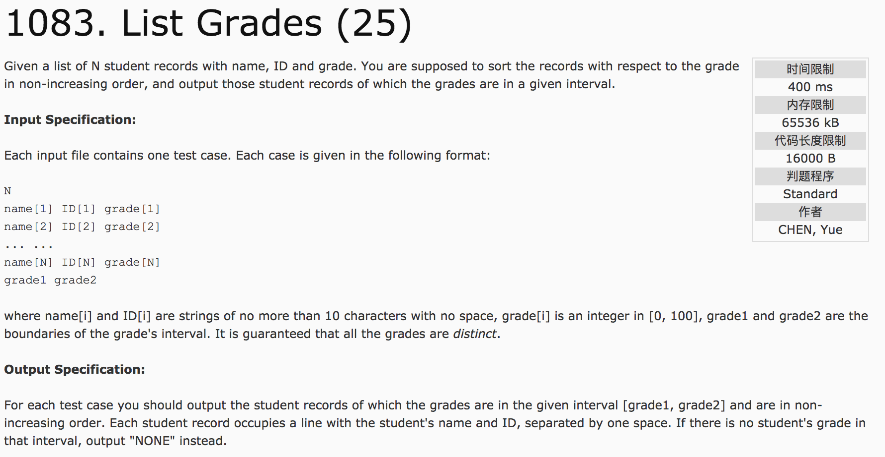
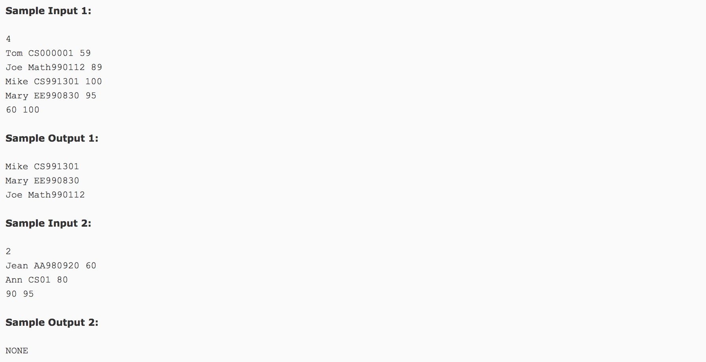

## List Grades(25)




题意：对N个学生（包括name, id, 以及成绩grade）的成绩进行分析，输出其指定成绩段的学生的name和id.**降序输出** 当不存在这样的学生时，输出NONE。

分析：建立学生的结构体，包含name, id ,grade，并对grade进行降序排列。然后，对成绩进行查找输出即可。

c++代码(subond)：

```
#include <cstdio>
#include <iostream>
#include <algorithm>
#include <cstring>
using namespace std;
struct node {
  string name;
  string id;
  int grade;
};
bool cmp(node a, node b) {
  return a.grade > b.grade;
}
int main() {
  int n, grade, grade1, grade2;
  string id;
  string name;
  scanf("%d", &n);
  node student[n];
  for(int i = 0; i < n; i ++) {
    cin >> name;
    cin >> id;
    scanf("%d", &grade);
    //scanf("%s %s %d", &name, &id, &grade);
    student[i].name = name;
    student[i].id = id;
    student[i].grade = grade;
  }
  scanf("%d %d", &grade1, &grade2);
  sort(student, student + n, cmp);
  int cnt = 0;
  for(int i = 0; i < n; i++) {
    if(student[i].grade >= grade1 && student[i].grade <= grade2) {
      // printf("%s %s", student[i].name, student[i].id);
      cnt++;
    }
  }
  if(cnt == 0)
    printf("NONE");
  else {
    for(int i = 0; i < n; i++) {
      if(student[i].grade >= grade1 && student[i].grade <= grade2) {
        cnt--;
        if(cnt == 0) {
          cout << student[i].name << " " << student[i].id;
          //printf("%s %s", student[i].name, student[i].id);
        }
        else {
          cout << student[i].name << " " << student[i].id << endl;
          //printf("%s %s\n", student[i].name, student[i].id);
        }
      }
    }
  }
  return 0;
}
```

c++代码(借鉴):

```
#include <cstdio>
#include <vector>
#include <algorithm>
using namespace std;
struct stu {
    char name[12];
    char id[12];
    int grade;
};
int cmp1(stu a, stu b) {
    return a.grade > b.grade;
}
int main() {
    int n, low, high, cnt = 0;
    scanf("%d", &n);
    vector<stu> v(n);
    for(int i = 0; i < n; i++) {
        scanf("%s %s %d", v[i].name, v[i].id, &v[i].grade);
    }
    scanf("%d %d", &low, &high);
    for(int i = 0; i < n; i++) {
        if(v[i].grade < low || v[i].grade > high) {
            v[i].grade = -1;
        } else {
            cnt++;
        }
    }
    sort(v.begin(), v.end(), cmp1);
    for(int i = 0; i < cnt; i++) {
        printf("%s %s\n", v[i].name, v[i].id);
    }
    if(cnt == 0)
        printf("NONE");
    return 0;
}
```
