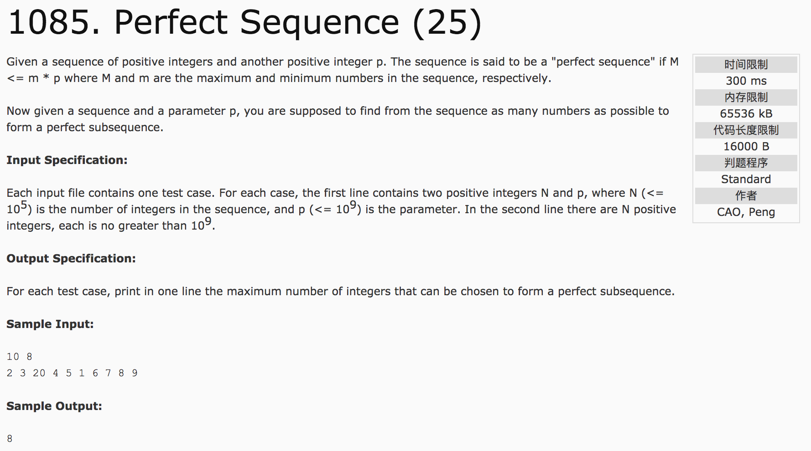

## Perfect Sequence(25)



题意：给定一个正整型序列和一个正整数p，其中M代表序列中的最大值，m代表序列中的最小数。如果M <= m * p，则称为“完美序列”。求满足"完美序列"的子序列中元素的最大个数。**动态规划**

分析：先对序列进行排序，之后进行动态规划。注意：使用j=i+result，比j=i更节时，可避免超时。

c++代码：

```
#include <iostream>
#include <algorithm>
using namespace std;
int main() {
  int n;
  long long p;
  cin >> n >> p;
  if(n == 0) {
    cout << 0;
    return 0;
  }
  long long int *a = new long long int [n];
  for(int i = 0; i < n; i++)
    cin >> a[i];
  sort(a, a+n);   //默认升序排列
  int result = 1;
  int temp = 1;
  for(int i = 0; i < n - 1; i++) {
    for(int j = i + result; j <= n - 1; j++) {  //使用i + result可以提供运行效率，避免运行超时
      if(a[i] * p >= a[j]) {
        temp = j - i + 1;
        if(temp > result)
          result = temp;
      } else {
        break;
      }
    }
  }
  cout << result;
  return 0;
}
```
