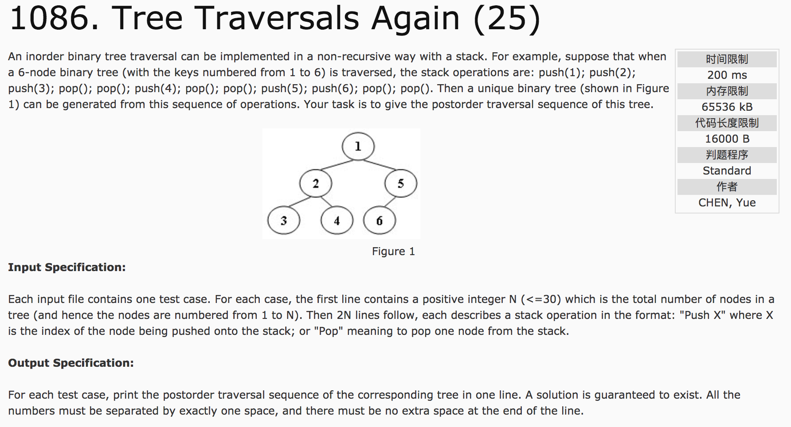
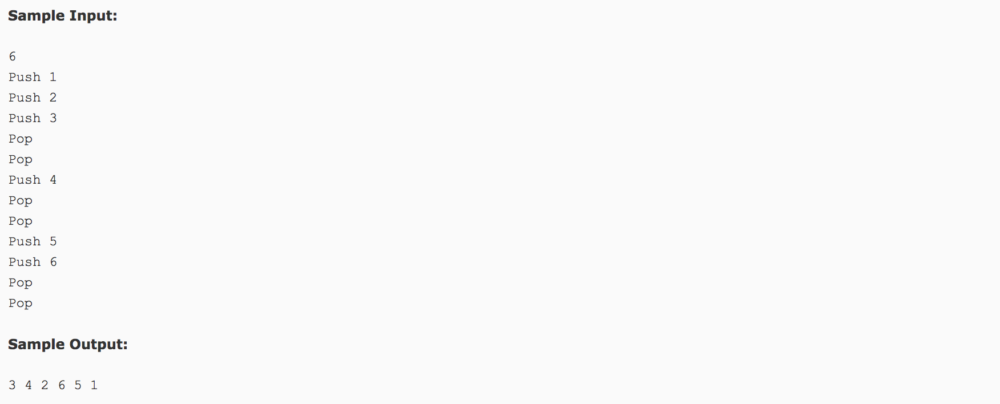

## Tree Traversals Again(25)




题意：用栈的形式给出二叉树的建立顺序，求这棵树的后序遍历。

分析：栈实现的是二叉树的中序遍历（左根右），而单独的push操作是二叉树的前序遍历（根左右）。因此，可以使用二叉树的前序和中序转后序的方法做。

c++代码：

```c++
#include <cstdio>
#include <vector>
#include <stack>
#include <cstring>
using namespace std;
vector<int> pre, in, post;
void pre2post(int root, int start, int end) {
  //root表示子树的根节点在在前序pre中的下标
  //start和end表示子树的最左边和最右边在中序in中的下标
  if(start > end) return;
  int i = start;
  //在中序in中寻找根节点，其下标标记为i
  while(i < end && in[i] != pre[root])
    i++;
  //i为根节点在中序in中的下标，则将中序分为两段
  //前半段，新根为 root+1, 起点 start, 终点 i-1
  pre2post(root + 1, start, i - 1);  //前半段的长度 i-start
  //后半段,新根为 root + 1 + （i - start）位移，起点 i+1, 终点 end
  pre2post(root + 1 + i - start, i + 1, end);
  post.push_back(pre[root]);
}
int main() {
  int n;
  scanf("%d", &n);
  char str[5];
  stack<int> s;
  while(~scanf("%s", str)) {
    if(strlen(str) == 4) {
      int num;
      scanf("%d", &num);
      pre.push_back(num);  //前序
      s.push(num);
    } else {
      in.push_back(s.top());  //中序
      s.pop();
    }
  }
  pre2post(0, 0, n - 1);
  printf("%d", post[0]);
  for(int i = 1; i < n; i++)
    printf(" %d", post[i]);
  return 0;
}
```
