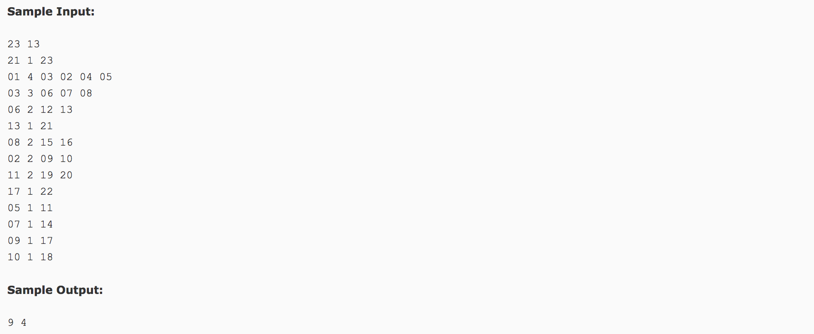

## The Largest Generation(25)




题意：族系谱。找出具有最大人口数的那一层及其标号，默认顶层为1。给定总人口数N(标号从01开始)和拥有子节点的数量M及其信息。

分析：使用深度优先搜索。**深度优先搜索** 传入的值为 **根节点** 和 **层数值**。其判断条件为 **该节点是否具有子节点**。（这个判断部分可以放入层数的计算语句，当然，计算层数的语句也可以放在DFS函数的开始部分）随后，依次对其子节点进行递归(层数+1)。

在每一层的节点的计算过程中，有两种方式：1）在DFS函数开始部分，对当前层进行自加1；2）在判断是否具有子节点之后，向下一层进行节点个数。

c++代码(subond&):

```c++
#include <cstdio>
#include <vector>
#include <algorithm>
using namespace std;
int book[100];
vector<int> v[100];
int maxdepth = -1;
void dfs(int index, int depth) {
  //book[depth]++;    //这样也可以，当前结点自加
  if(v[index].size() == 0) {
    maxdepth = max(depth, maxdepth);
    return;
  }
  book[depth + 1] += v[index].size();  //将该结点的子节点加入下一层数据中
  for(int i = 0; i < v[index].size(); i++) {
    dfs(v[index][i], depth + 1);
  }
}
int main() {
  int n, m, node, k, c;
  scanf("%d %d", &n, &m);
  for(int i = 0; i < m; i++) {
    scanf("%d %d", &node, &k);
    for(int j = 0; j < k; j++) {
      scanf("%d", &c);
      v[node].push_back(c);
    }
  }
  dfs(1,1);
  book[1] = 1;
  int maxnum = 0, maxlevel = -1;
  for(int j = 1; j <= maxdepth; j++) {
    if(book[j] > maxnum) {
      maxnum = book[j];
      maxlevel = j;
    }
  }
  printf("%d %d", maxnum, maxlevel);
  return 0;
}
```
