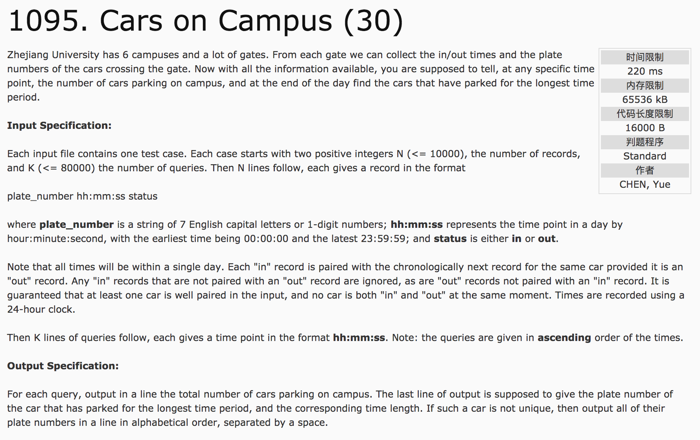
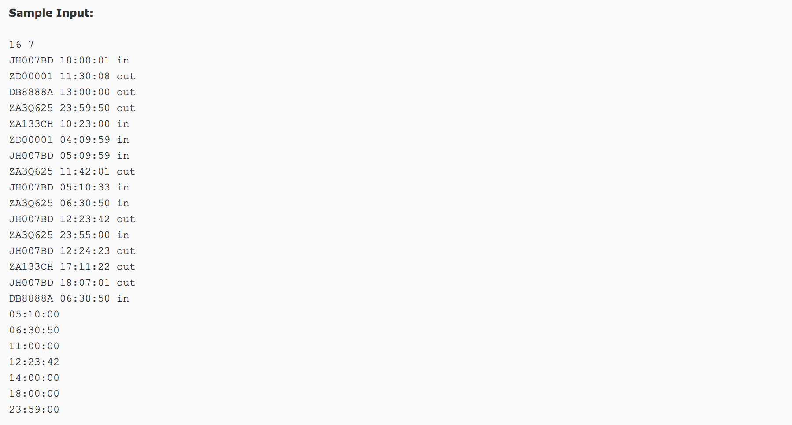
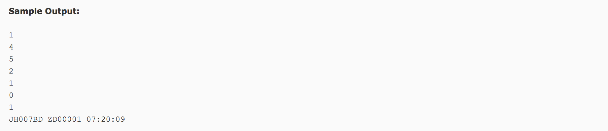

## Car on Campus(30)





分析：

1）存储有效数据。同时具有in和out两条记录的车子，才算一条有效数据。同时考虑到输出的顺序按id的字母顺序。因此，对每条记录的先进行id字母排序，在进行时间排序。这样前后两者只要保证id相同即为一个有效数据。

得到有效记录后，一定将记录保存至另一数组中，并与后序使用。巧妙的设计in和out的标志位(in/1, out/-1)，可以减少计算量。

2）利用map容器，存储每个车子的停留时间。map<string, int> mapp;其输出采用迭代器。

```c++
#include <map>
using namespace std;
map<string, int> mapp;
mapp[record[i].id] += record[i + 1].time - record[i].time;
for(map<string, int>::iterator it = mapp.begin(); it != mapp.end(); it++) {
  if(it->second = maxtime)
    printf("%s ", it->first.c_str());
}
```

3)判断每个时间点上的停留的车辆总数。对得到的有效记录，仅进行时间排序。只要记录in和out的标志位，即可得到现在的车辆总数。

```c++
for(int i = 0; i < car.size(); i++) {
  if(i == 0)
    count[i] = car[i].flag;
  else
    count[i] = count[i - 1] + car[i].flag;  //当前时间点的车辆总数
}
//调用
int tempindex = 0;
for(int i = 0; i < k; i++) {
  int j;
  int time;  //依次增大
  for(j = tempindex; j < car.size(); j++) {
    if(car[j].time > time) {  //则前一个小于等于time
      printf("%d\n", count[j - 1]);
      break;
    } else if(j == car.size() - 1) {
      printf("%d\n", count[j]);
    }
  }
  tempindex = j;
}
```

c++代码：

```c++
#include <cstdio>
#include <vector>
#include <algorithm>
#include <string.h>
#include <cstring>
#include <map>
using namespace std;
struct node {
  char id[10];
  int time;
  int flag = 0;
};
bool cmp1(node a, node b) {
  if(strcmp(a.id, b.id) != 0)
    return strcmp(a.id, b.id) < 0;
  else
    return a.time < b.time;
}
bool cmp2(node a, node b) {
  return a.time < b.time;
}
int main() {
  int n, k, maxtime = -1, tempindex = 0;
  scanf("%d %d", &n, &k);
  vector<node> record(n), car;
  for(int i = 0; i < n; i++) {
    char temp[5];
    int h, m, s;
    scanf("%s %d:%d:%d %s", record[i].id, &h, &m, &s, temp);
    int temptime = h * 3600 + m * 60 + s;
    record[i].time = temptime;
    record[i].flag = strcmp(temp, "in") == 0 ? 1 : -1;  //1 in -1 out
  }
  sort(record.begin(), record.end(), cmp1);
  map<string, int> mapp;
  for(int i = 0; i < n - 1; i++) {
    if(strcmp(record[i].id, record[i + 1].id) == 0 && record[i].flag == 1 && record[i + 1].flag == -1) {
      car.push_back(record[i]);
      car.push_back(record[i + 1]);
      mapp[record[i].id] += (record[i + 1].time - record[i].time);
      if(maxtime < mapp[record[i].id]) {
        maxtime = mapp[record[i].id];
      }
    }
  }
  sort(car.begin(), car.end(), cmp2);  //重新排序，按时间，统计车辆信息，类似栈操作
  vector<int> count(n);
  for(int i = 0; i < car.size(); i++) {
    if(i == 0)
      count[i] += car[i].flag;
    else
      count[i] = count[i - 1] + car[i].flag;
  }
  for(int i = 0; i < k; i++) {
    int h, m, s;
    scanf("%d:%d:%d", &h, &m, &s);
    int temptime = h * 3600 + m * 60 + s;
    int j;
    for(j = tempindex; j < car.size(); j++) {
      if(car[j].time > temptime) {
        printf("%d\n", count[j - 1]);
        break;
      } else if(j == car.size() - 1){
        printf("%d\n", count[j]);
      }
    }
    tempindex = j;
  }
  for(map<string, int>::iterator it = mapp.begin(); it != mapp.end(); it++) {
    if(it->second == maxtime)
      printf("%s ", it->first.c_str());
  }
  printf("%02d:%02d:%02d", maxtime / 3600, (maxtime % 3600) / 60, maxtime % 60);
  return 0;
}
```
