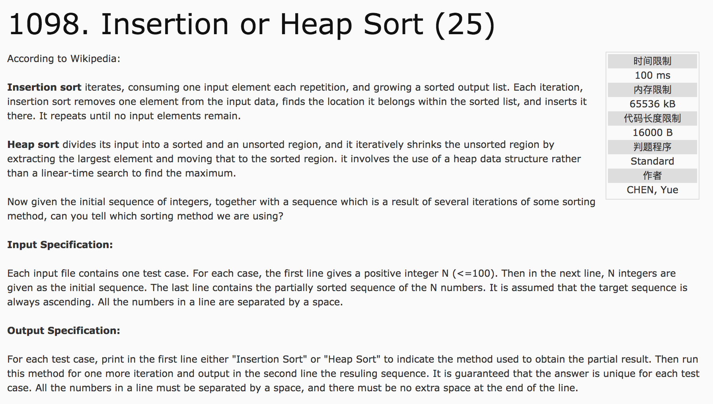
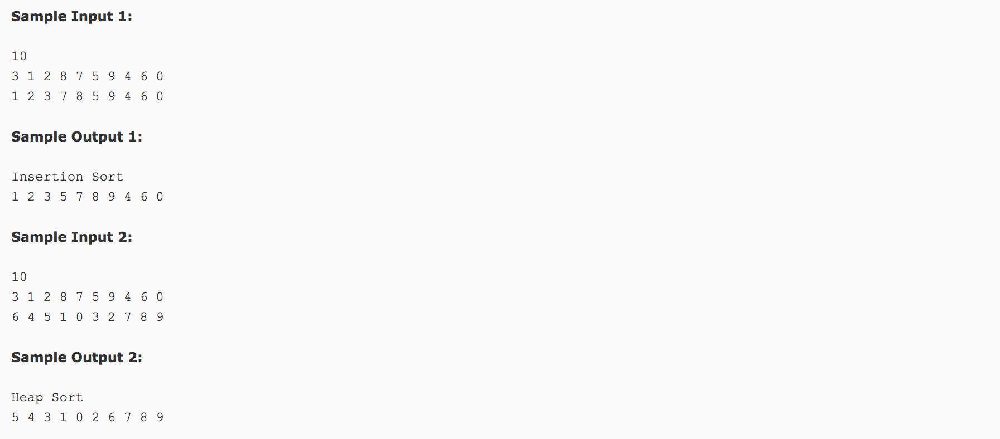

## Insertion or Heap Sort(25)




分析：插入排序 与 堆排序

c++代码：

```c++
#include <cstdio>
#include <vector>
#include <algorithm>
using namespace std;
vector<int> a, b;
void Adjust(int low, int high) {
  int i = 1, j = i * 2;
  while(j <= high) {
    if(j + 1 <= high && b[j] < b[j + 1])
      j = j + 1;
    if(b[i] < b[j]) {
      swap(b[i], b[j]);
      i = j;
      j = i * 2;
    } else {
      break;
    }
  }
}
int main() {
  int n;
  scanf("%d", &n);
  a.resize(n + 1);
  b.resize(n + 1);
  for(int i = 1 ; i <= n; i++)
    scanf("%d", &a[i]);
  for(int i = 1; i <= n; i++)
    scanf("%d", &b[i]);
  int p = 2;
  while(p <= n && b[p - 1] <= b[p]) p++;
  int index = p;
  while(p <= n && a[p] == b[p]) p++;
  if(p == n + 1) {
    printf("Insertion Sort\n");
    sort(b.begin() + 1, b.begin() + index + 1);
    printf("%d", b[1]);
    for(int i = 2; i <= n; i++)
      printf(" %d", b[i]);
  } else {
    printf("Heap Sort\n");
    p = n;
    while(p >= 2 && b[p] >= b[p - 1]) p--;
    swap(b[1], b[p]);
    Adjust(1, p - 1);
    printf("%d", b[1]);
    for(int i = 2; i <= n; i++)
      printf(" %d", b[i]);
  }
  return 0;
}
```
