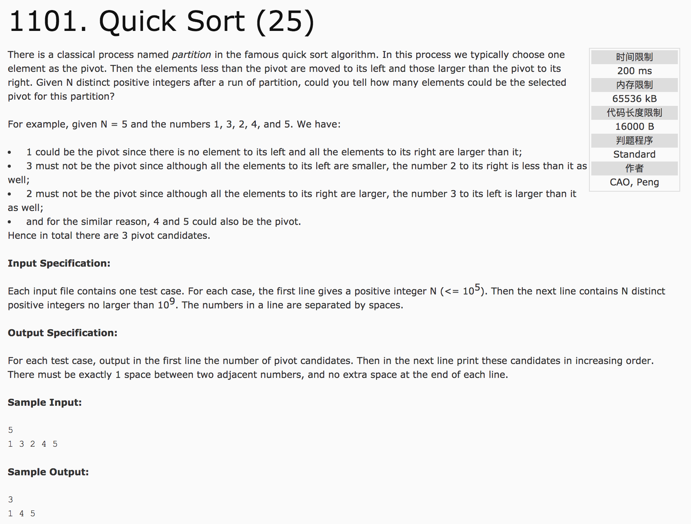

## Quick Sort(25)



题意：快速排序

分析：**从结果的角度考虑，而不是考虑过程**。

pivot值肯定是那些 原序列与有序序列(从小到大)在相同位置上元素值也相同的点，并且 **该值要大于原序列此值前面序列的最大值**。

c++代码：

```c++
#include <cstdio>
#include <iostream>
#include <vector>
#include <algorithm>
using namespace std;
int a[100005], b[100005];
int main() {
  int n;
  scanf("%d", &n);
  for(int i = 0; i < n; i++) {
    scanf("%d", &a[i]);
    b[i] = a[i];
  }
  sort(a, a + n);
  int v[100005];
  int max = 0;
  int count = 0;
  for(int i = 0; i < n; i++) {
    if(a[i] == b[i] && b[i] > max) {
      v[count++] = b[i];
    }
    if(max < b[i])  //保证前面的序列的最大值要小于当前值
      max = b[i];
  }
  printf("%d\n", count);
  for(int i = 0; i < count; i++) {
    if(i == 0)
      printf("%d", v[i]);
    else
      printf(" %d", v[i]);
  }
  printf("\n");
  return 0;
}
```
