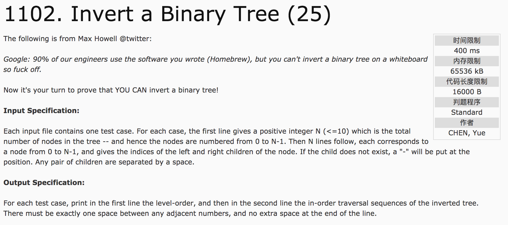
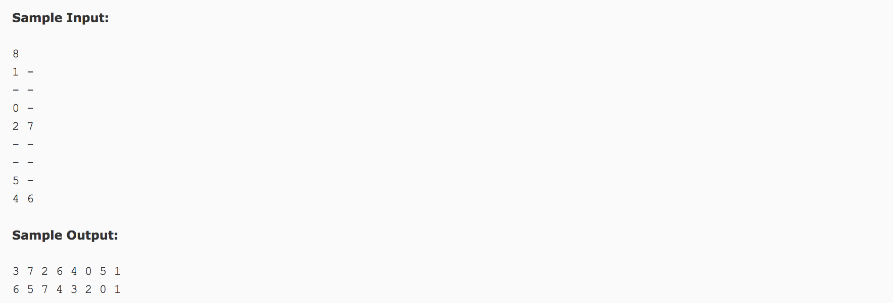

## Invert a Binary Tree(25)




题意：**倒置二进制树** 给定一个二叉树（节点数为N <= 10)，将其反转，并输出层序序列和中序序列。

分析：

1) 反转二叉树，在存储过程中交换左右结点的即可。

2) 使用结构体保存结点信息，tree[i].left和tree[i].right。

3）**根结点是所有左右结点没有出现过的结点**。

4）已知根结点，使用 **递归方式将中序遍历** 结果push_back存储在数组in(vector类型)。

注意：深入理解中序序列，左 根 右。其函数如下：

```c++
#include <vector>
struct node {
  int left, right;
};
vector<node> tree;
vector<int> in;
void inorder(int root) {
  //判断结束条件
  if(tree[root].left == -1 && tree[root].right == -1) {
    in.push_back(root);
    return;
  }
  //左子树
  if(tree[root].left != -1)
    inorder(tree[root].left);
  //根结点
  in.push_back(root);
  //右子树
  if(tree[root].right != -1)
    inorder(tree[root].right);
}
```

5）已知根结点，用 **队列广度优先搜索**，队列里面的元素就是层序遍历的结果，push_back存储在数组level(vector类型)。

```c++
#include <vector>
#include <queue>
struct node {
  int left, right;
};
vector<int> level;
queue<int> q;
q.push(root);
while(!q.empty()) {
  int index = q.front();
  q.pop();
  if(tree[index].left != -1)
    q.push(tree[index].left);
  if(tree[index].right != -1)
    q.push(tree[index].right);
  level.push_back(index);
}
```

c++代码：

```c++
#include <cstdio>
#include <vector>
#include <queue>
using namespace std;
struct node {
  int left, right;
};
vector<node> tree;
vector<int> in;
void inorder(int root) {
  if(tree[root].left == -1 && tree[root].right == -1) {
    in.push_back(root);
    return;
  }
  if(tree[root].left != -1)
    inorder(tree[root].left);
  in.push_back(root);
  if(tree[root].right != -1)
    inorder(tree[root].right);
}
int main() {
  int n, root;
  scanf("%d", &n);getchar();
  tree.resize(n);
  vector<int> book(n, 0);
  for(int i = 0; i < n; i++) {
    char c1, c2;
    scanf("%c %c", &c1, &c2);getchar();
    tree[i].right = (c1 == '-' ? -1 : (c1 - '0'));
    tree[i].left = (c2 == '-' ? -1 : (c2 - '0'));
    if(tree[i].left != -1)
      book[tree[i].left] = 1;
    if(tree[i].right != -1)
      book[tree[i].right] = 1;
  }
  for(int i = 0; i < n; i++) {
    if(book[i] == 0) {
      root = i;
      break;
    }
  }
  queue<int> q;
  q.push(root);
  vector<int> level;
  while(!q.empty()) {
    int index = q.front();
    q.pop();
    if(tree[index].left != -1)
      q.push(tree[index].left);
    if(tree[index].right != -1)
      q.push(tree[index].right);
    level.push_back(index);
  }
  for(int i = 0; i < n; i++)
    printf("%d%c", level[i], i == n - 1 ? '\n' : ' ');
  inorder(root);
  printf("%d", in[0]);
  for(int i = 1; i < n; i++) {
    printf(" %d", in[i]);
  }
  return 0;
}
```
