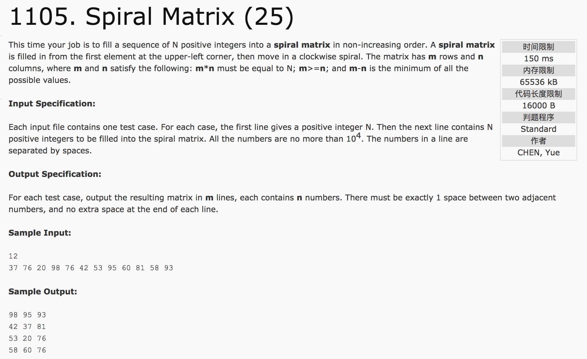

## Spiral Matrix(25)



题意：

分析：

1）当偶数行时，在m/2行结束；当奇数行时，m/2 + m%2行结束。

2）每循环一次，数据的起始地址为[i][j]，即左上角地址。因此，循环一次，将数据分成四段分别赋值(向右，向下，向左，向上)

向右：行不变，列变化。行为 i，列为 i 至 n-1-i;

向下：列不变，行变化。行为 i+1 至 m-1-(i+1)，列为 n-1-i;

向左：行不变，列变化。行为 m-1-i, 列为 n-1-i 至 i;

向上：列不变，行变化。行为 m-1-(i+1) 至 i+1, 列为 i;

**无论怎样变化，要保证总行数为m, 总列数为n。**

c++代码：

```c++
#include <cmath>
#include <vector>
#include <cstdio>
#include <algorithm>
using namespace std;
int func(int N) {
    int i = sqrt((double)N);
    while(i >= 1) {
        if(N % i == 0)
            return i;
        i--;
    }
    return 1;
}

int cmp(int a, int b) {return a > b;}

int main() {
    int N, m, n, t = 0;
    scanf("%d", &N);
    n = func(N);
    m = N / n;
    vector<int> a(N);
    for (int i = 0; i < N; i++)
        scanf("%d", &a[i]);
    sort(a.begin(), a.end(), cmp);
    vector<vector<int> > b(m, vector<int>(n));
    int level = m / 2 + m % 2;
    for (int i = 0; i < level; i++) {
        for (int j = i; j <= n - 1 - i && t <= N - 1; j++)
                b[i][j] = a[t++];
        for (int j = i + 1; j <= m - 2 - i && t <= N - 1; j++)
                b[j][n - 1 - i] = a[t++];
        for (int j = n - i - 1; j >= i && t <= N - 1; j--)
                b[m - 1 - i][j] = a[t++];
        for (int j = m - 2 - i; j >= i + 1 && t <= N - 1; j--)
                b[j][i] = a[t++];
    }
    for (int i = 0; i < m; i++) {
        for (int j = 0 ; j < n; j++) {
            printf("%d", b[i][j]);
            if (j != n - 1) printf(" ");
        }
        printf("\n");
    }
    return 0;
}
```
