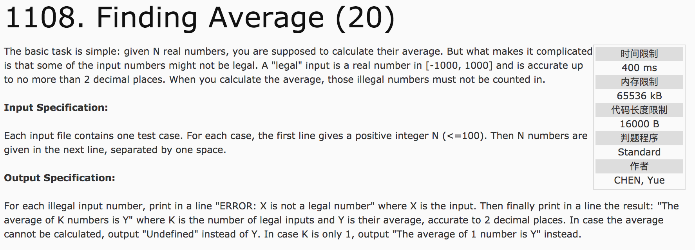
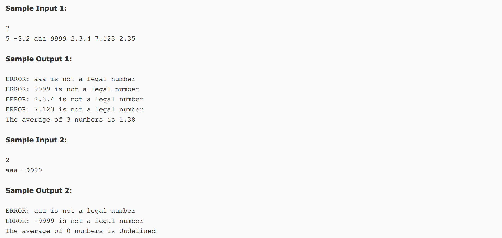

## Finding Average(20)




分析：

sscanf():从一个字符串中读进与指定格式相符的数据

`sscanf(a, "%lf", &temp);`

sprintf():把格式化的数据写入字符串中

`sprintf(b, "%.2lf", temp);`

c++代码：

```c++
#include <iostream>
#include <cstdio>
#include <string.h>
using namespace std;
int main() {
  int n, count = 0;
  char a[50], b[50];
  double temp, sum = 0.0;
  cin >> n;
  for(int i = 0; i < n; i++) {
    scanf("%s", a);
    sscanf(a, "%lf", &temp);
    sprintf(b, "%.2lf", temp);
    int flag = 0;
    for(int j = 0; j < strlen(a); j++) {
      if(a[j] != b[j]) {
        flag = 1;
      }
    }
    if(flag || temp < -1000 || temp > 1000) {
      printf("ERROR: %s is not a legal number\n", a);
      continue;
    } else {
      sum += temp;
      count++;
    }
  }
  if(count == 1) {
    printf("The average of 1 number is %.2lf", sum);
  } else if(count > 1) {
    printf("The average of %d numbers is %.2lf", count, sum / count);
  } else {
    printf("The average of 0 numbers is Undefined");
  }
  return 0;
}
```
