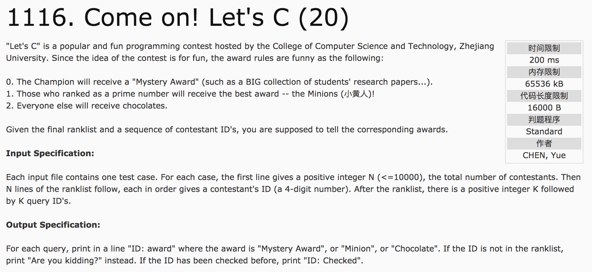
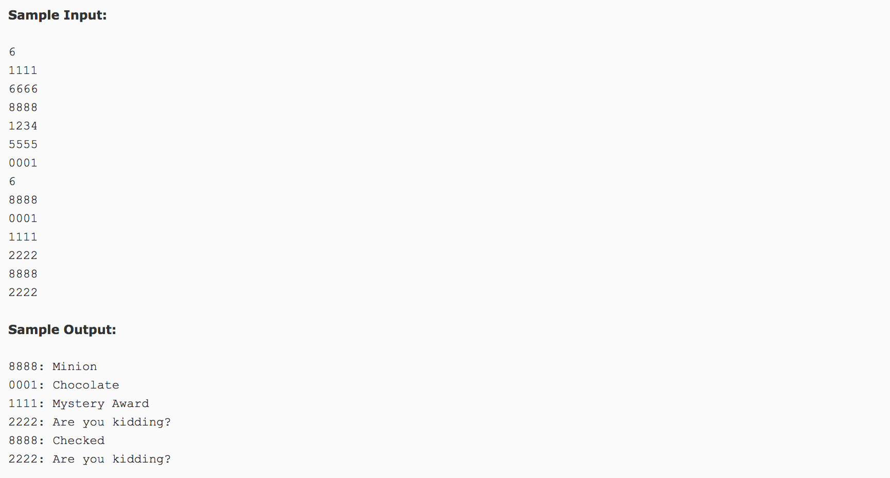

## Come on! Let's C(20)




分析：

1）set的应用。数据的查找，不重复。

2）素数的判断。

3）**当输出有多重判断时，应选择从大范围到小范围的方式，逐一锁定**。

c++代码：

```c++
#include <cstdio>
#include <cmath>
#include <set>
using namespace std;
bool isprime(int number) {
  if(number <= 1) return false;
  int sqr = int(sqrt(number * 1.0));
  for(int i = 2; i <= sqr; i++) {
    if(number % i == 0)
      return false;
  }
  return true;
}
int main() {
  int n, m, temp, rank[10000];
  scanf("%d", &n);
  for(int i = 0; i < n; i++) {
    scanf("%d", &temp);
    rank[temp] = i + 1;
  }
  scanf("%d", &m);
  set<int> ss;
  for(int i = 0; i < m; i++) {
    scanf("%d", &temp);
    printf("%04d: ", temp);
    if(rank[temp] == 0) {
      printf("Are you kidding?\n");
      continue;
    }
    if(ss.find(temp) == ss.end()) {
      ss.insert(temp);
    } else {
      printf("Checked\n");
      continue;
    }
    if(rank[temp] == 1) {
      printf("Mystery Award\n");
    } else if(isprime(rank[temp])) {
      printf("Minion\n");
    } else {
      printf("Chocolate\n");
    }
  }
  return 0;
}
```
