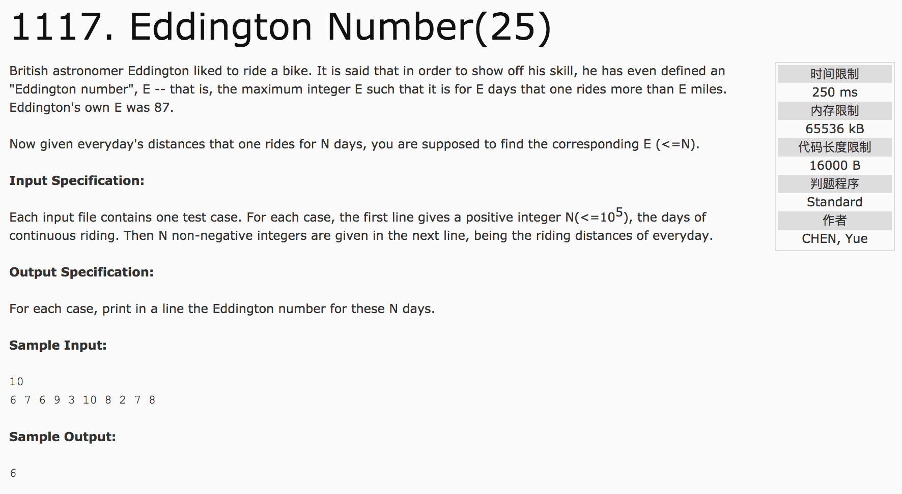

## Eddington Number(25)



分析：题意为满足E天骑车超过E公里的最大正整数E, 而没有说连续的E天。

1）先对数组排序，找出满足a[i] > i (i从1开始)的最大数。

c++代码(subond):

```c++
#include <cstdio>
#include <vector>
#include <algorithm>
using namespace std;
bool cmp(int a, int b) {
  return a > b;
}
int main() {
  int n, temp;
  vector<int> v;
  scanf("%d", &n);
  for(int i = 0; i < n; i++) {
    scanf("%d", &temp);
    v.push_back(temp);
  }
  sort(v.begin(), v.end(), cmp);
  int count = 0;
  for(int i = 0; i < n; i++) {
    if(v[i] > i + 1)
      count++;
    else
      break;
  }
  printf("%d", count);
  return 0;
}
```
