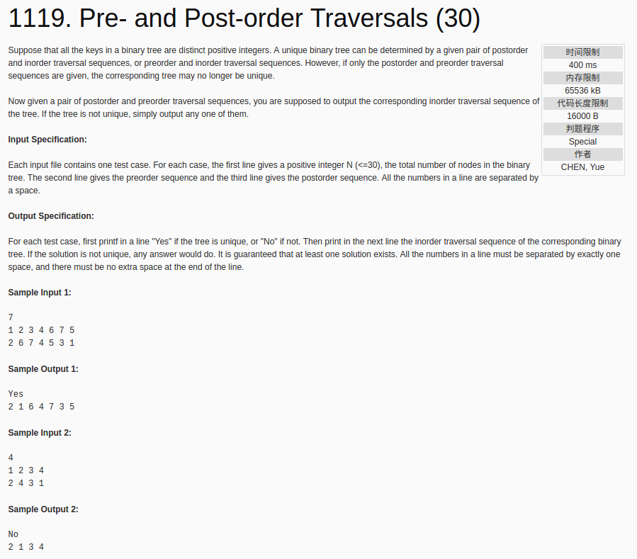

## Pre- and Post-order Traversals(30)



c++代码：

```c++
#include <cstdio>
#include <vector>
using namespace std;
vector<int> ans;
int *pre, *post, unique = 1;
int findfrompre(int x, int l, int r) {
  for(int i = l; i <= r; i++) {
    if(x == pre[i])
      return i;
  }
  return -1;
}
void setin(int prel, int prer, int postl, int postr) {
  if(prel == prer) {
    ans.push_back(pre[prel]);
    return;
  }
  if(pre[prel] == post[postr]) {
    int x = findfrompre(post[postr - 1], prel + 1, prer);
    if(x - prel > 1) {
      setin(prel + 1, x - 1, postl, postl + x - prel - 2);
      ans.push_back(post[postr]);
      setin(x, prer, postl + x - prel - 2 + 1, postr - 1);
    } else {
      unique = 0;
      ans.push_back(post[postr]);
      setin(x, prer, postl + x - prel - 2 + 1, postr - 1);
    }
  }
}
int main() {
  int n;
  scanf("%d", &n);
  pre = new int [n];
  post = new int [n];
  for(int i = 0; i < n; i++)
    scanf("%d", &pre[i]);
  for(int i = 0; i < n; i++)
    scanf("%d", &post[i]);
  setin(0, n - 1, 0, n - 1);
  printf("%s\n", unique ? "Yes" : "No");
  printf("%d", ans[0]);
  for(int i = 1; i < ans.size(); i++)
    printf(" %d", ans[i]);
  printf("\n");
  return 0;
}
```
