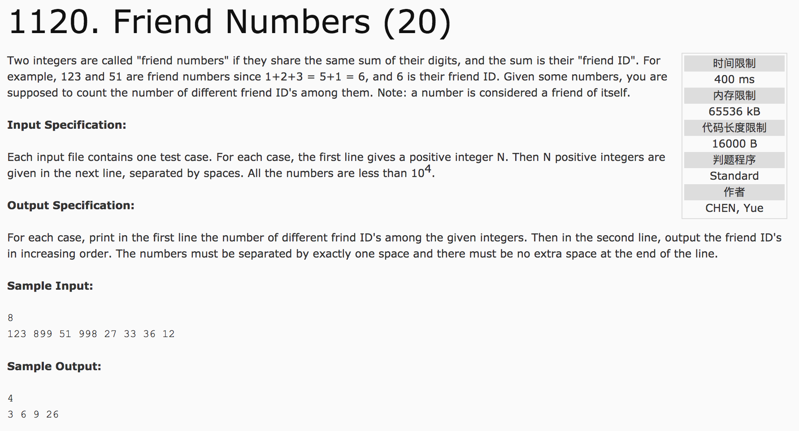

## Friend Numbers(20)



题意：友好数字：一个数字其各位上的数字相加的和等于另一个数字其各个位上的数字相加的和，这个和称为友好id。一个数是其本身的友好数字。

分析：

1）各个位求和

```c++
int friendid(int num) {
  int sum = 0;
  while(num != 0) {
    sum += num % 10;
    num /= 10;
  }
  return sum;
}

c++代码：

```c++
#include <cstdio>
#include <set>
using namespace std;
int friendid(int num) {
  int sum = 0;
  while(num != 0) {
    sum += num % 10;
    num = num / 10;
  }
  return sum;
}
int main() {
  int n, num;
  set<int> s;
  scanf("%d", &n);
  for(int i = 0; i < n; i++) {
    scanf("%d", &num);
    s.insert(friendid(num));
  }
  printf("%d\n", s.size());
  for(set<int>::iterator it = s.begin(); it != s.end(); it++) {
    if(it != s.begin())
      printf(" ");
    printf("%d", *it);
  }
  return 0;
}
```
