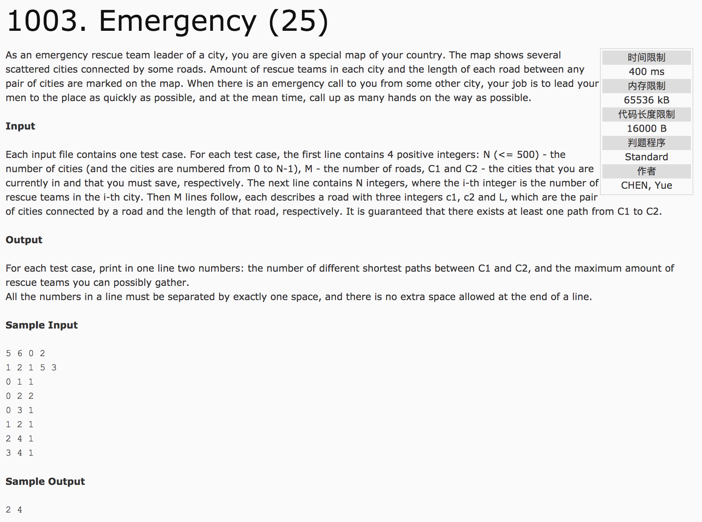

## Emergency(25)



题意：给定城市数目N（编号从0至N-1)以及每个城市里的救援队的数量，M条路（连通城市）以及权值（距离），救援队当前所在城市C1和目的地城市C2。求C1至C2的最短路径以及可以集合到的最大救援队的数量。

分析：用Dijkstra算法。设num[i]和w[i]表示从出发点到i结点拥有的路的条数，以及能够找到的救援队的数目。当判定dis[u] + e[u][v] < dis[v]的时候，不仅仅要更新dis[v]，还要更新num[v] = num[u], w[v] = weight[v] + w[u]; 如果dis[u] + e[u][v] == dis[v]，还要更新num[v] += num[u]，而且判断一下是否权重w[v]更小，如果更小了就更新w[v] = weight[v] + w[u];

c++代码：

```
#include <cstdio>
#include <algorithm>
using namespace std;
int n, m, c1, c2;
int dis[510], weight[510], e[510][510], num[510], w[510];
bool visit[510] = {false};
const int inf = 99999999;
int main() {
    scanf("%d%d%d%d", &n, &m, &c1, &c2);
    for(int i = 0; i < n; i++)
        scanf("%d", &weight[i]);
    fill(e[0], e[0] + 510 * 510, inf);  //边值初始化，标记为最大
    fill(dis, dis + 510, inf);   //距离初始化，标记为最大
    int a, b, c;
    for(int i = 0; i < m; i++) {
        scanf("%d%d%d", &a, &b, &c);
        e[a][b] = c;    //存放边的信息，行，列表示城市的标号，值表示边的大小
        e[b][a] = c;
    }
    dis[c1] = 0;   //dis[i]表示从起点到i结点的距离，将起点的距离设为0
    w[c1] = weight[c1];  //w[i]表示从起点到i结点可以集合到的救援队的数量，计入起点的救援队的数量，即初始数量
    num[c1] = 1;    //num[i]表示从起点到i结点的路的数量
    for(int i = 0; i < n; i++) {
        int u = -1, minn = inf;
        //第一步，查找起点
        for(int j = 0; j < n; j++) {
            if(visit[j] == false && dis[j] < minn) {
                u = j;
                minn = dis[j];
            }  //先找到起点
        }
        if(u == -1) break;
        visit[u] = true;  //找到起点，并标记为经过
        //第二步，寻找下一结点
        for(int v = 0; v < n; v++) {
            if(visit[v] == false && e[u][v] != inf) {  //如果下一结点未经过并且存在边
                if(dis[u] + e[u][v] < dis[v]) {  //当新计入的距离小于下一结点距离时，则计入结点（下一结点），并更新距离值
                    dis[v] = dis[u] + e[u][v];   //更新距离值
                    num[v] = num[u];   //更新路的数量，保持不变
                    w[v] = w[u] + weight[v];   //更新救援队的数量
                } else if(dis[u] + e[u][v] == dis[v]) {  //当新计入的距离等于下一结点的距离时，则说明发现新路径
                    num[v] = num[v] + num[u];  //更新路的数量
                    if(w[u] + weight[v] > w[v])  //并且，只有救援队数量超过下一结点的救援队数量时，更新救援队数量
                        w[v] = w[u] + weight[v];
                }
            }
        }
        //第三步，循环
    }
    printf("%d %d", num[c2], w[c2]);
    return 0;
}
```
