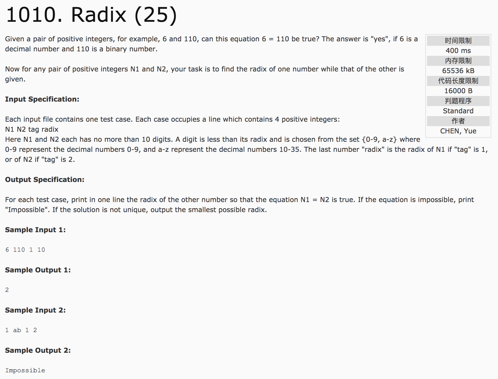

## Radix(25)



分析：进制转换

c++代码：

```c++
#include <cstdio>
#include <cstring>
#include <algorithm>
using namespace std;
long long inf = (1LL << 63) - 1;
long long map[256];
char n1[20], n2[20];
int tag, radix;
long long convertToTen(char a[], long long radix, long long t) {
    long long ans = 0;
    int len = strlen(a);
    for(int i = 0; i < len; i++) {
        ans = ans * radix + map[a[i]];
        if(ans < 0 || ans > t) return -1;
    }
    return ans;
}

int cmp(char n2[], long long radix, long long t) {
    int len = strlen(n2);
    long long num = convertToTen(n2, radix, t);
    if(num < 0) return 1;
    if(num < t) return -1;
    return (t == num) ? 0 : 1;
}

long long binarySearch(char n2[], long long left, long long right, long long t) {
    long long mid;
    while(left <= right) {
        mid = (left + right) / 2;
        int flag = cmp(n2, mid, t);
        if(flag == 0) return mid;
        else if(flag == -1) left = mid + 1;
        else right = mid - 1;
    }
    return -1;
}

int findLargestDigit(char n2[]) {
    int ans = -1, len = strlen(n2);
    for(int i = 0; i < len; i++) {
        if(map[n2[i]] > ans) {
            ans = map[n2[i]];
        }
    }
    return ans + 1;
}

int main() {
    scanf("%s%s%d%d", &n1, &n2, &tag, &radix);
    for(char c = '0'; c <= '9'; c++) {
        map[c] = c - '0';
    }
    for(char c = 'a'; c <= 'z'; c++) {
        map[c] = c - 'a' + 10;
    }
    if(tag == 2) {
        swap(n1, n2);
    }
    long long t = convertToTen(n1, radix, inf);
    long long low = findLargestDigit(n2);
    long long high = max(low, t) + 1;
    long long ans = binarySearch(n2, low, high, t);
    if(ans == -1) printf("Impossible");
    else printf("%lld", ans);
    return 0;
}
```
