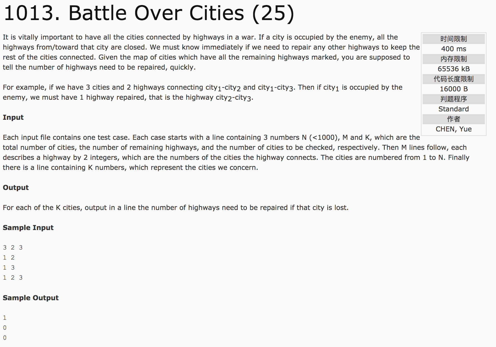

## Battle Over Cities(25)



题意：N个城市（标号1-N），M条路及其连接城市的信息，以及目标城市的数量和标号。求当目标城市及其道路牺牲后，至少需要修建多少条路才能保证剩下的城市之间保持连接。

给出n个城市之间有相互连接的m条道路，当删除一个城市和其连接的道路的时候，问其他几个剩余的城市至少要添加多少个路线才能让它们重新变为连通图。

分析：**添加的最少的路线，就是他们的连通分量数-1，因为当a个互相分立的连通分量需要变为连通图的时候，只需要添加a-1个路线，就能让他们相连。所以这道题就是求去除了某个结点之后其他的图所拥有的连通分量数。**

使用邻接矩阵存储，对于每一个被占领的城市，去除这个城市结点，就是把它标记为已经访问过，这样在深度优先遍历的时候，对于所有未访问的结点进行遍历，就能求到所有的连通分量的个数~~~记得因为有很多个要判断的数据，每一次输入被占领的城市之前要把visit数组置为false

c++代码：

```
#include <cstdio>
#include <algorithm>
using namespace std;
int v[1010][1010];
bool visit[1010];
int n;
void dfs(int node) {
    visit[node] = true;
    for(int i = 1; i <= n; i++) {
        if(visit[i] == false && v[node][i] == 1)
            dfs(i);
    }
}
int main() {
    int m, k, a, b;
    scanf("%d%d%d", &n, &m, &k);
    for(int i = 0; i < m; i++) {
        scanf("%d%d", &a, &b);
        v[a][b] = v[b][a] = 1;
    }
    for(int i = 0; i < k; i++) {
        fill(visit, visit + 1010, false);
        scanf("%d", &a);
        int cnt = 0;
        visit[a] = true;
        for(int j = 1; j <= n; j++) {
            if(visit[j] == false) {
                dfs(j);
                cnt++;
            }
        }
        printf("%d\n", cnt - 1);
    }
    return 0;
}
```
