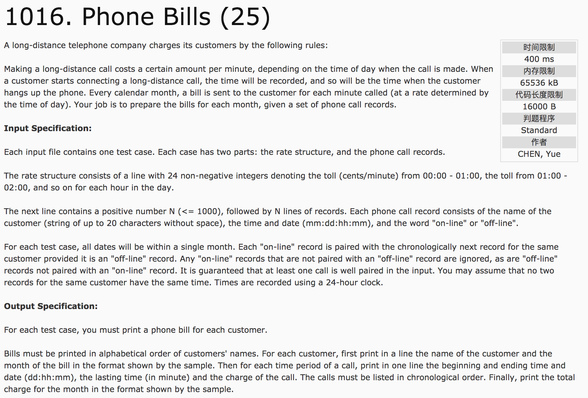
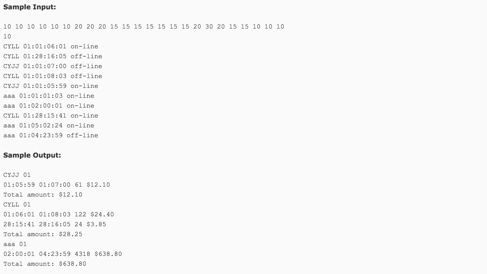

## Phone Bills(25)




题意：给定一天中每个小时的计费结构和客户的通话时间记录，求话费账单。

分析：因为数据杂乱无章，因此数据保存后应该进行排序(按照姓名、月份，日期，小时，分钟的优先顺序进行排序，便于形成一条一条的记录)。

1）建立记录结构体。

```c++
#include <string.h>
struct Record {
  char name[25];
  int month, dd, hh, mm;
  bool status;  //true为on-line, false为off-line
};
//数据排序
bool cmp(Record a, Record b) {
  if(strcmp(a.name, b.name) != 0) return a.name < b.name;
  else if(a.month != b.month) return a.month < b.month;
  else if(a.dd != b.dd) return a.dd < b.dd;
  else if(a.hh != b.hh) return a.hh < b.hh;
  else return a.mm < b.mm;
}
```

c++代码
