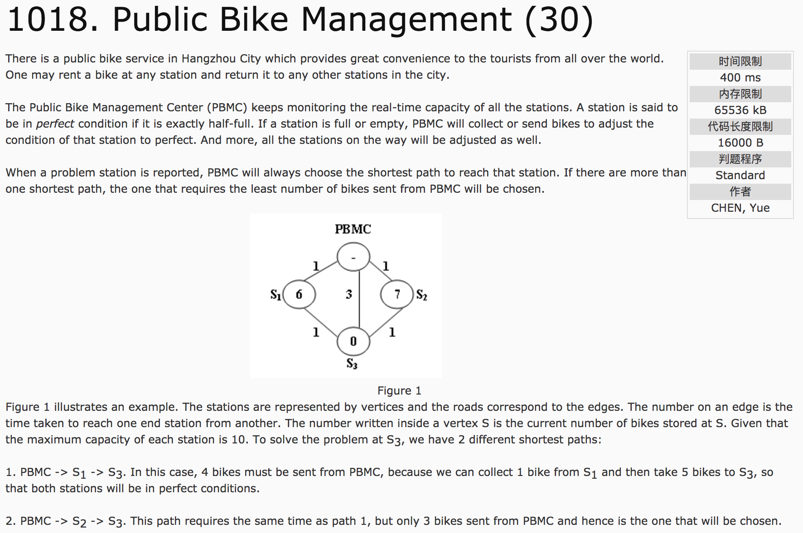
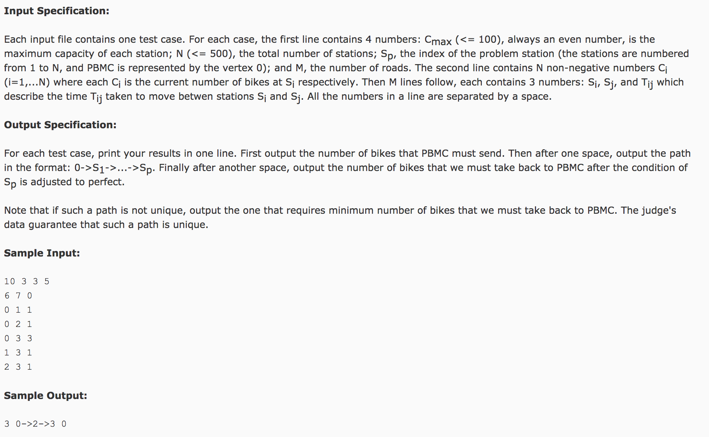

## Public Bike Management(25)




题意：对于每一个自行车车站，其容量是一个偶数Cmax。如果车站的自行车数量刚好是其总容量的1/2，视为完美状态。**如果车站为满或者空状态，控制中心PBMC（视为0）将会携带或从路上收集一定数量的自行车前往该车站站，并且将沿途所经车站均调整为完美状态。**（这就程序的最终目标）**如果路径不唯一，则选取从车站携带数量最少的一条路径**。给出容量Cmax，车站数量N，目标车站Sp，M条边及其权值（距离值），求最短路径。**如果最短路径有多条，则选择从车站带回自行车数量最少的那一条。**

分析：使用Dijkstra算法和DFS深度优先搜索算法。因为只有Dijkstra算法是不可以的，因为minNeed和minBack不满足最优子结构，不是简单的相加过程，只有在所有的路径确定了之后，才能区分最小的Need和最小的Back。因此，使用Dijkstra算法求最短路径，使用DFS求最小的Need，最小的Back和Path。

DFS模拟一遍路径需要调整的问题，记录的最后的Need和Back，并与minNeed和minBack比较，根据情况更新Path，最后输出minNeed，minBack和Path。

c++代码：

```
#include<cstdio>
#include<vector>
#include<algorithm>
using namespace std;
const int inf = 99999999;
int cmax, n, sp, m;
int minNeed = inf, minBack = inf;
int e[500][500], dis[500], weight[500];  //e表示边，dis表示距起点的距离，weight表示车站相对完美状态的自行车的数量（即，自行车的相对值）
bool visit[500] = false;
vector<int> pre[500];  //pre表示满足最短路径的条件下，当前结点的前一结点信息（形成树，供dfs使用）
vector<int> path, temppath;
void dfs(int v) {  //传入目标结点
  //递归结束条件，v=0
  if(v == 0) {
    //说明这是一条完整路径
    temppath.push_back(v);
    int need = 0, back = 0;
    //求取路径的need和back
    for(int i = temppath.size() - 1; i >= 0; i--) {
      int id = temppath[i];
      if(weight[id] > 0) {  //车辆多余，需要带回
        back += weight[id];
      }
      else {  //车辆不足需要补充
        if(back > (0 - weight[id])) {  //用back补充不足车辆
          back += weight[id];
        } else { //需要携带补充
          need += ((0 - weight) - back);
          back = 0;   //back清零
        }
      }
    }
    //判断need和back
    if(need < minNeed) {
      minNeed = need;
      minBack = back;
      path = temppath;
    }
    else if(need == minNeed && back < minBack) {
      minBack = back;
      path = temppath;
    }
    temppath.pop_back();
    return ;
  }
  temppath.push_back(v);
  for(int i = 0; i < pre[v].size(); i++)  //因为最短路径可能不唯一，逐一使用dfs算法，并递归
    dfs(pre[v][i]);
  temppath.pop_back();
}
int main() {
  fill(e, e + 500 * 500, inf);
  fill(dis, dis + 500, inf);
  scanf("%d %d %d %d", &cmax, &n, &sp, &m);
  for(int i = 1; i <= n; i++) {  //标号0归PBMC所有
    scanf("%d", &weight[i]);
    weight[i] = weight[i] - cmax / 2;
  }
  for(int i = 0; i < m; i++) {
    int a, b, c;
    scanf("%d %d %d", &a, &b, &c);
    e[a][b] = c;
    e[b][a] = c;
  }
  //Dijkstra算法
  dis[0] = 0;
  for(int i = 0; i <= n; i++) {
    int u = -1， minn = inf;
    //第一步，查找起点
    for(int j = 0; j <= n; j++) {
      if(visit[j] == false && dis[j] < minn) {
        u = j;
        minn = dis[j]；
      }
    }
    if(u == -1) break;
    第二步，查找下一结点
    for(int v = 0; v <=n; v++) {
      if(visit[v] == false && e[u][v] != inf) {
        if(dis[u] + e[u][v] < dis[v]) {
          dis[v] = dis[u] + e[u][v];
          pre[v].clear();
          pre[v].push_back(u);
        } else if(dis[u] + e[u][v] == dis[v]) {
          pre[v].push_back(u);
        }
      }
    }
  }
  dfs(sp);
  printf("%d 0", minNeed);
  for(int i = path.size() - 2; i >= 0; i--)
    printf("->%d", path[i]);
  printf(" %", minBack);
  return 0;
}
```
