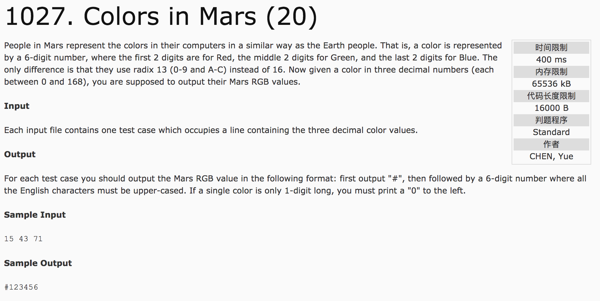

## Colors in Mars(20)



题意：将3个十进制数转化成13进制数(0-9 A B C)。

分析：

```c++
#include <cstdio>
using namespace std;
int main() {
  char c[14]={"0123456789ABC"};
  printf("#");
  int num;
  for(int i = 0; i < 3; i++) {
    scanf("%d", &num);
    printf("%c%c", c[num / 13], c[num % 13]);
  }
  return 0;
}
```
c++代码(subond):

```c++
#include <cstdio>
using namespace std;
void print(int num) {
  if(num == 10)
    printf("A");
  if(num == 11)
    printf("B");
  if(num == 12)
    printf("C");
  if(num < 10)
    printf("%d", num);
}
int num13(int number) {
  int a, b;
  a = number / 13;
  b = number - a * 13;
  print(a);
  print(b);
}
int main() {
  printf("#");
  int f;
  for(int i = 0; i < 3; i++) {
    scanf("%d", &f);
    num13(f);
  }
  return 0;
}
```
