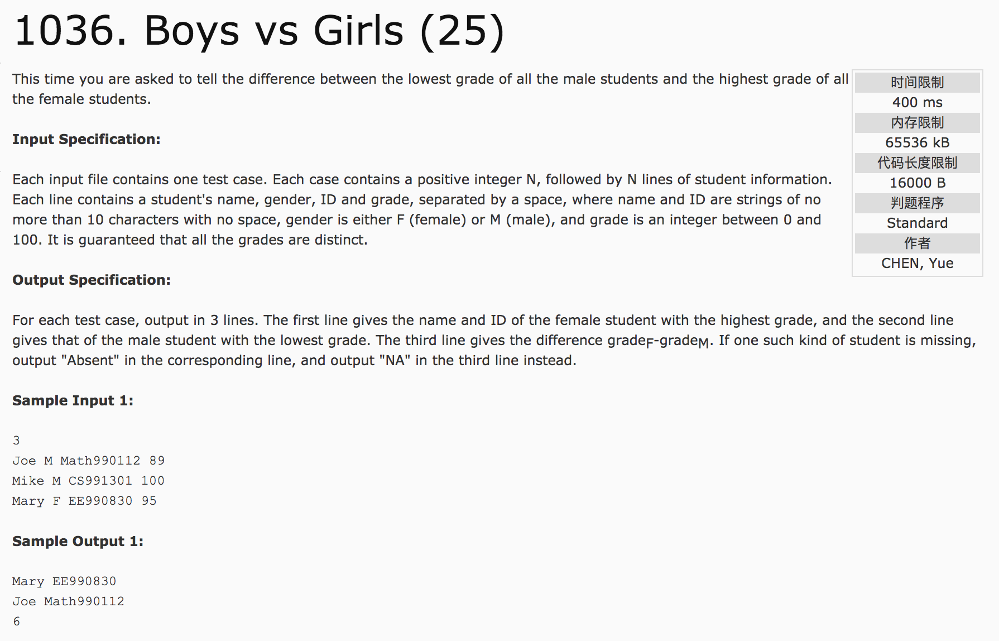
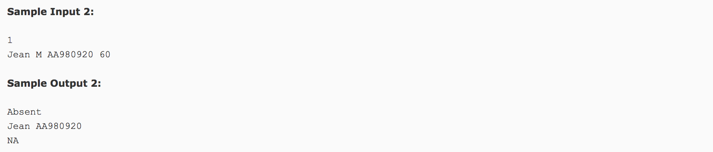

## Boys vs Girls




题意：输出男生的最低成绩和女生的最高成绩。

分析：1) 建立学生结构体，在存储的时候将男女学生的数据存入不同的vector对象中。2）对成绩进行排序，输出即可。

注意：**vector对象存储信息后要resize()。分开存储数据时，注意各自的index不同步。**


```c++
#include <cstdio>
#include <vector>
#include <algorithm>
#include <cstring>
#include <iostream>
using namespace std;
struct node {
  string name;
  char gender;
  string id;
  int grade;
};
bool cmp1(node a, node b) {
  return a.grade > b.grade;  //降序
}
bool cmp2(node a, node b) {
  return a.grade < b.grade;  //升序
}
int main() {
  int n;
  scanf("%d", &n);
  int flag1 = 0, flag2 = 0, grade;
  char gender;
  string name, id;
  int j = 0, t = 0;
  vector<node> stuf(n), stum(n);
  for(int i = 0; i < n; i++) {
    //scanf("%s %c %s %d", name, &gender, id, &grade);
    cin >> name >> gender >> id;
    scanf("%d", &grade);
    if(gender == 'F') {
      stuf[j].name = name;
      stuf[j].gender = gender;
      stuf[j].id = id;
      stuf[j].grade = grade;
      flag1 = 1;
      j++;
    }
    if(gender == 'M') {
      stum[t].name = name;
      stum[t].gender = gender;
      stum[t].id = id;
      stum[t].grade = grade;
      flag2 = 1;
      t++;
    }
  }
  stuf.resize(j);
  stum.resize(t);
  sort(stuf.begin(), stuf.end(), cmp1);  //降序
  sort(stum.begin(), stum.end(), cmp2);  //升序
  if(flag1 == 1) {
    //printf("%s %s\n", stuf[0].name, stuf[0].id);
    cout << stuf[0].name << " " << stuf[0].id << endl;
  } else {
    printf("Absent\n");
  }
  if(flag2 == 1) {
    //printf("%s %s\n", stum[0].name, stum[0].id);
    cout << stum[0].name << " " << stum[0].id << endl;
  } else {
    printf("Absent\n");
  }
  if(flag1 == 1 && flag2 == 1) {
    printf("%d", stuf[0].grade - stum[0].grade);
  } else {
    printf("NA");
  }
  return 0;
}
```
