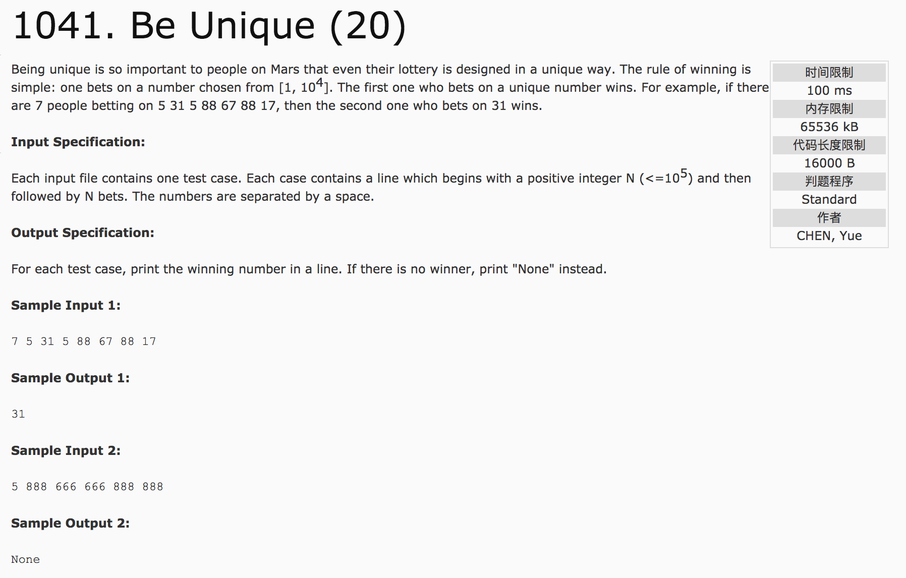

##  Be Unique(20)



分析：Hash散列。给定一组数列，寻找数列中第一次出现次数为1的那个数。

c++代码：

```c++
#include <cstdio>
using namespace std;
int num[100005];
int count[100005];
int main() {
  int n;
  scanf("%d",&n);
  for(int i = 0; i < n; i++) {
    scanf("%d", &num[i]);
    count[num[i]]++;
  }
  for(int i = 0; i < n; i++) {
    if(count[num[i]] == 1) {
      printf("%d", num[i]);
      return 0;
    }
  }
  printf("None");
  return 0;
}
```
