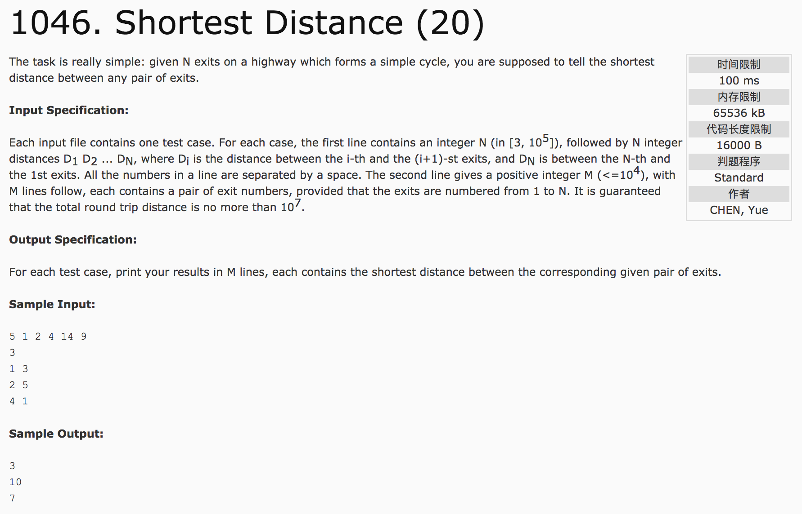

## Shortest Distance(20)



分析：圆环。分段。

c++代码：

```c++
#include <cstdio>
#include <algorithm>
using namespace std;
int main() {
  int n, m, temp, sum = 0;
  scanf("%d", &n);
  int dis[n] = {0};
  for(int i = 1; i <= n; i++) {
    scanf("%d", &temp);
    sum += temp;
    dis[i] = sum;
  }
  scanf("%d", &m);
  int a, b, result;
  for(int i = 0; i < m; i++) {
    scanf("%d %d", &a, &b);
    if(a > b) {
      int k = a;
      a = b;
      b = k;
    }
    result = dis[b - 1] - dis[a - 1];
    result = min(result, sum - result);
    printf("%d\n", result);
  }
  return 0;
}
```
