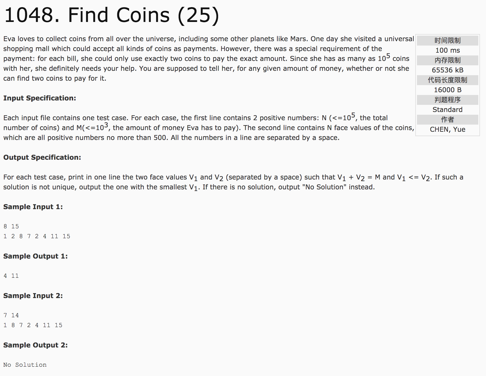

## Find Coins(25)



分析：给定一组数列a(元素可能重复)和值num，找出a中的两个元素，其实v1 + v2 = num，并且v1 <= v2。

现将数列排序，并且在存储时记录元素出现的次数。

c++代码(subond):

```c++
#include <cstdio>
#include <vector>
#include <algorithm>
using namespace std;
vector<int> v;
int visit[100005] = {0};
int main() {
  int N, M;
  scanf("%d %d", &N, &M);
  v.resize(N);
  for(int i = 0; i < N; i++) {
    scanf("%d", &v[i]);
    if(visit[v[i]] == 1) {
      visit[v[i]]++;
    } else {
      visit[v[i]] = 1;
    }
  }
  sort(v.begin(), v.end());
  int temp = 0;
  for(int i = 0; i < N - 1; i++) {
    temp = M - v[i];
    if(visit[temp]) {
      if(temp != v[i]) {
        printf("%d %d", v[i], temp);
        return 0;
      }
      if(temp == v[i]) {
        if(visit[temp] > 1) {
          printf("%d %d", v[i], v[i]);
          return 0;
        } else {
          printf("No Solution");
          return 0;
        }
      }
    }
  }
  printf("No Solution");
  return 0;
}
```
