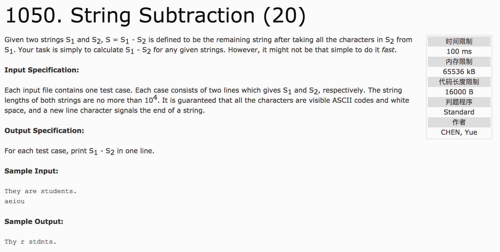

## String Subtraction(20)



题意：给定两个字符串，从第一个字符串s1中删除第二个字符串s2的所有字符，并输出。

分析：

1) 因为保存数据时需要同时保留 空格 字符。因此，使用getline()或者cin.getline()函数。

getline()函数为string流，需要包含头文件#include<string.h>。其保留的类型为string，若要获取字符串的长度，可以使用成员函数length()。

cin.get()函数为istream流，包含头文件#include<iostream>即可。其保存的类型为char(或char数组)，若要获取字符串的长度，可以使用函数strlen()。

c++代码(subond):

使用getline()

```c++
#include <iostream>
#include <string.h>
using namespace std;
string s1, s2;
int visit[128] = {0};
int main() {
  getline(cin, s1);
  getline(cin, s2);
  for(int i = 0; i < s2.length(); i++)
    visit[int(s2[i])] = 1;
  int t = 0;
  for(int i = 0; i < s1.length(); i++) {
    if(visit[int(s1[i])] != 1)
      cout << s1[i];
  }
  return 0;
}

```

使用cin.getline()

```c++
#include <iostream>
#include <string.h>
using namespace std;
char s1[10005], s2[10005];
int main() {
    cin.getline(s1, 10005);
    cin.getline(s2, 10005);
    int lens1 = strlen(s1);
    int lens2 = strlen(s2);
    bool flag[256] = {false};
    for(int i = 0; i < lens2; i++) {
        flag[s2[i]] = true;
    }
    for(int i = 0; i < lens1; i++) {
        if(!flag[s1[i]])
          cout << s1[i];
    }
    return 0;
}
```
