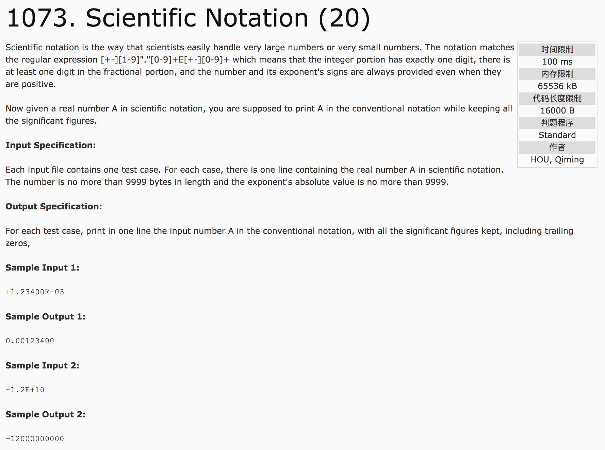

## Scientific Notation(20)



```c++
#include <iostream>
#include <string>
using namespace std;

int main() {
  string s;
  cin >> s;
  int len = s.length();
  if (s[0] == '-')
      cout << "-";
  int pose = 0;
  for (int i = 1; i < len; i++) {
    if (s[i] == 'E')
        pose = i;
  }
  int after = 0;
  for (int i = pose + 2; i < len; i++) {
    after = (s[i] - '0') + 10 * after;
  }
  if (s[pose + 1] == '-') {
    if (after > 0) {
      cout << "0.";
      for (int i = 1; i < after; i++) {
        cout << 0;
      }
      for (int i = 1; i < pose; i++) {
        if (s[i] >= '0' && s[i] <= '9') {
            cout << s[i];
        }
      }
    } else {
      for (int i = 1; i < pose; i++) {
        if (i == 2 - after) {
            cout << ".";
        }
        if (s[i] >= '0' && s[i] <= '9') {
            cout << s[i];
        }
      }
    }
  } else {
      if (pose - 3 < after) {
          if (s[1] != '0')
              cout << s[1];
          for (int i = 3; i < pose; i++) {
              if (s[i] >= '0' && s[i] <= '9') {
                  cout << s[i];
              }
          }
          for (int i = 0; i < after - (pose - 3); i++) {
              cout << 0;
          }
      } else {
          if (s[1] != '0')
              cout << s[1];
          for (int i = 3; i < pose; i++) {
              if (i == 3 + after) {
                  cout << ".";
              }
              if (s[i] >= '0' && s[i] <= '9') {
                  cout << s[i];
              }
          }
      }
  }
  return 0;
}
```
