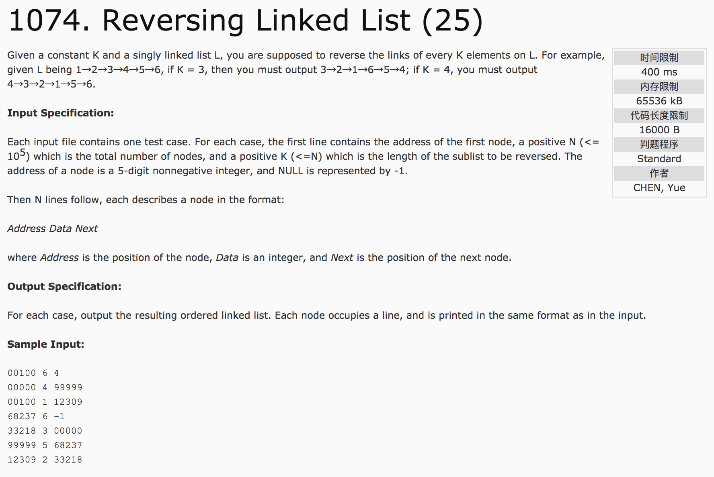
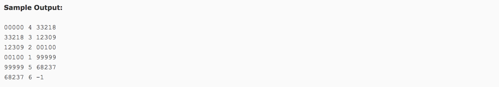

## Reversing Linked List(25)




分析：

1）用数组list[max]形成地址值的链表，用data[max]表示每个地址的值。

2）每k个重新排序。

```c++
int i;
for(i = 0; i < (sum - sum % k); i++) {
  result[i] = list[k - 1 + i / k * k - i % k];
}
for(; i < sum; i++)
  result[i] = list[i];
```

c++代码：

```c++
#include <iostream>
using namespace std;
int main() {
  int first, n, k;
  cin >> first >> n >> k;
  int temp, data[100010], next[100010];
  for(int i = 0; i < n; i++) {
    cin >> temp;
    cin >> data[temp];
    cin >> next[temp];
  }
  int list[100010], sum = 0;
  int result[100010];
  while(first != -1) {
    list[sum++] = first;
    first = next[first];
  }
  int i;
  for(i = 0; i < (sum - sum % k); i++) {
    result[i] = list[k - 1 + i / k * k - i % k];
  }
  for(; i < sum; i++)
    result[i] = list[i];
  for (int i = 0; i < sum - 1; i++)
      printf("%05d %d %05d\n", result[i], data[result[i]], result[i + 1]);
  printf("%05d %d -1", result[sum - 1], data[result[sum - 1]]);
  return 0;
}
```
