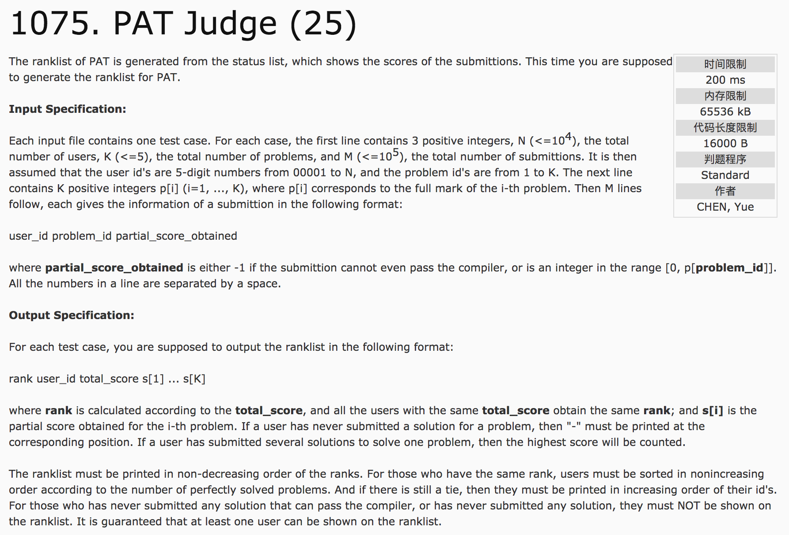
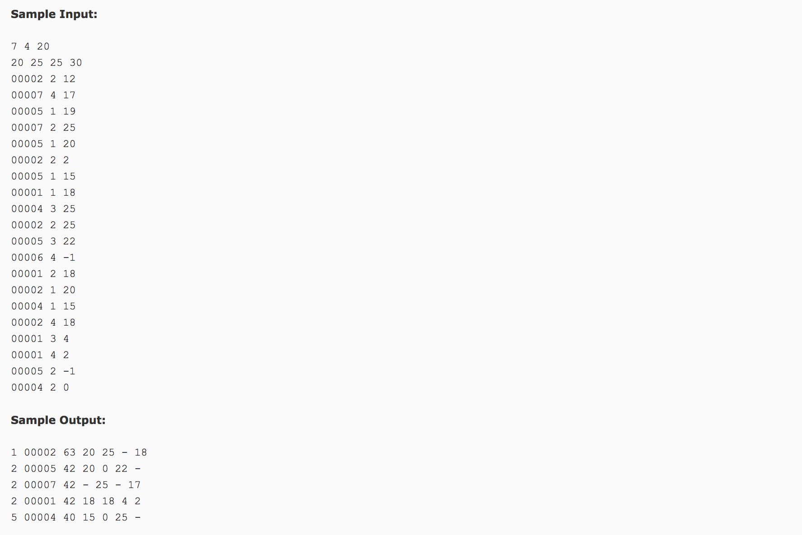

## PAT Judge(25)




c++代码：

```c++
#include <cstdio>
#include <vector>
#include <algorithm>
using namespace std;
struct node {
    int rank, id, total = 0;
    vector<int> score;
    int passnum = 0;
    bool isshown = false;
};
bool cmp1(node a, node b) {
    if(a.total != b.total)
        return a.total > b.total;
    else if(a.passnum != b.passnum)
        return a.passnum > b.passnum;
    else
        return a.id < b.id;
}

int main() {
    int n, k, m, id, num, score;
    scanf("%d %d %d", &n, &k, &m);
    vector<node> v(n + 1);
    for(int i = 1; i <= n; i++)
        v[i].score.resize(k + 1, -1);
    vector<int> full(k + 1);
    for(int i = 1; i <= k; i++)
        scanf("%d", &full[i]);
    for(int i = 0; i < m; i++) {
        scanf("%d %d %d", &id, &num, &score);
        v[id].id = id;
        v[id].score[num] = max(v[id].score[num], score);
        if(score != -1)
            v[id].isshown = true;
        else if(v[id].score[num] == -1)
            v[id].score[num] = -2;
    }
    for(int i = 1; i <= n; i++) {
        for(int j = 1; j <= k; j++) {
            if(v[i].score[j] != -1 && v[i].score[j] != -2)
                v[i].total += v[i].score[j];
            if(v[i].score[j] == full[j])
                v[i].passnum++;
        }
    }
    sort(v.begin() + 1, v.end(), cmp1);
    for(int i = 1; i <= n; i++) {
        v[i].rank = i;
        if(i != 1 && v[i].total == v[i - 1].total)
            v[i].rank = v[i - 1].rank;
    }
    for(int i = 1; i <= n; i++) {
        if(v[i].isshown == true) {
            printf("%d %05d %d", v[i].rank, v[i].id, v[i].total);
            for(int j = 1; j <= k; j++) {
                if(v[i].score[j] != -1 && v[i].score[j] != -2)
                    printf(" %d", v[i].score[j]);
                else if(v[i].score[j] == -1)
                    printf(" -");
                else
                    printf(" 0");
            }
            printf("\n");
        }
    }
    return 0;
}
```
