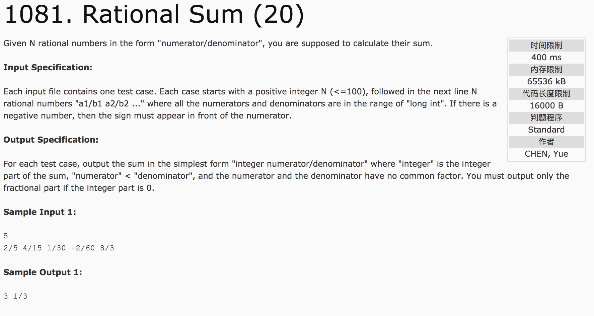
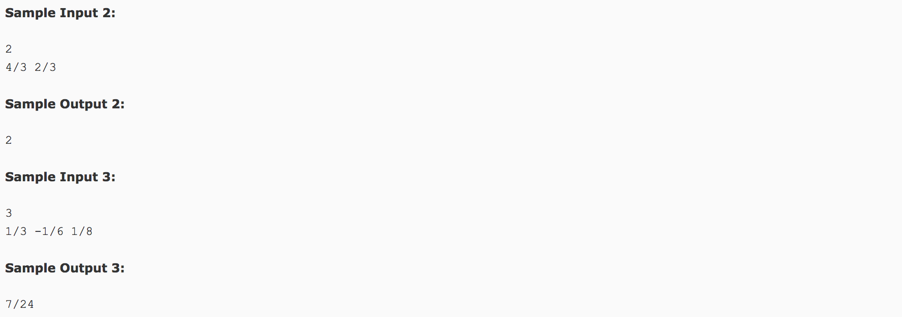

## Rational Sum(20)




题意：对N个有理数（Rational Number）进行求和。主要是分数的四则运算。

分析：**根据分数的加法公式累加，后分离出整数部分和分数部分**。

题目中交代分子和分母都输出长整型long int，不能用int存储。为了避免加和超出存储长度，使用long long进行存储。

分子和分母分别进行求和值时，为了计算方便，每加一次值就进行一次约分处理（同时除以最大公约数）。其分子和分母的初值为0和1。

suma = a * sumb + b * suma;
sumb = b * sumb;
gcdvalue = gcd(suma, sumb);
suma = suma / gcdvalue;
sumb = sumb / gcdvalue;

c++代码：

```
#include <cstdio>
#include <cstdlib>
using namespace std;
long long gcd(long long a, long long b) {
  return b == 0 ? abs(a) : gcd(b, a % b);
}
int main() {
  int n;
  long long a, b, suma = 0, sumb = 1, gcdvalue;
  scanf("%d", &n);
  for(int i = 0; i < n; i++) {
    scanf("%lld/%lld", &a, &b);
    gcdvalue = gcd(a, b);  //求其最大公约数
    //约分
    a = a / gcdvalue;
    b = b / gcdvalue;
    //分式计算
    suma = a * sumb + b * suma;
    sumb = b * sumb;
    gcdvalue = gcd(suma, sumb);
    //约分
    suma = suma / gcdvalue;
    sumb = sumb / gcdvalue;
  }
  long long x = suma / sumb;
  long long y = suma - (sumb * x);
  if(x != 0) {
    printf("%lld", x);
    if(y != 0) {
      printf(" %lld/%lld", y, sumb);
    }
  } else {
    if(y != 0) {
      printf("%lld/%lld", y, sumb);
    } else {
      printf("0");
    }
  }
  return 0;
}
```
