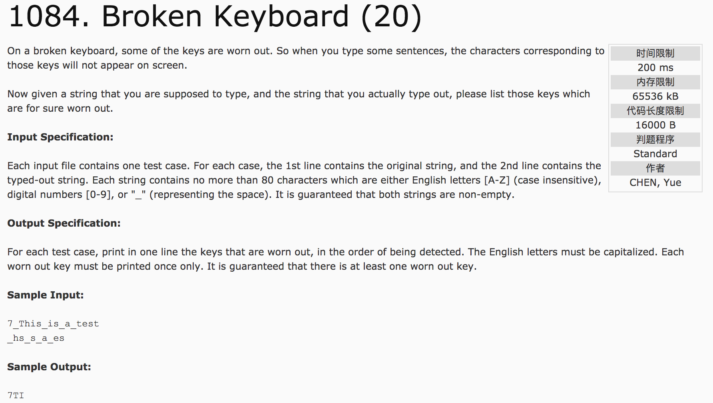

## Broken Keyboard (20)



题意：给定一段话(包括a-z,A-Z,0-9)的两个版本，一个是完整的，称为a，另一个是残缺的，称为b。找出残缺中缺少的字符。

分析：第一步，逐位匹配字符，将a中比b多的字符筛选出来，称为c，并统一大小写。第二步，去除c中的重复字符。最后，输出c即是所求。

c++代码：

```
#include <iostream>
#include <cstring>
#include <cctype>
using namespace std;
int main() {
  string a, b;
  int lena, lenb;
  cin >> a >> b;
  lena = a.length();
  lenb = b.length();
  char c[100];
  int i = 0, j = 0, t = 0;
  while(j <= lenb - 1) {
    if(b[j] != a[i]) {
      c[t++] = a[i];
      i++;
    } else {
      i++;
      j++;
    }
  }
  if(i != lena) {
    for(int k = i; k <= lena - 1; k++) {
      c[t++] = a[k];
    }
  }
  int k = 0;
  while(k < t) {
    c[k] = toupper(c[k]);
    k++;
  }
  for(int k = 0; k < t; k++) {
    for(int m = 0; m < k; m++) {
      if(c[m] == c[k])
        c[k] = '#';
    }
  }
  for(int k = 0; k < t; k++) {
    if(c[k] != '#')
      cout << c[k];
  }
  return 0;
}
```
