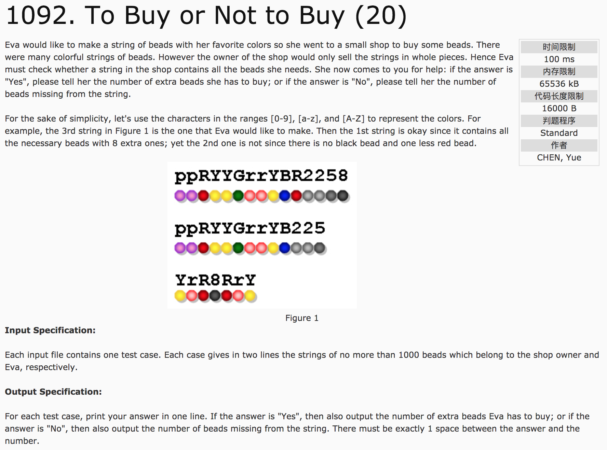
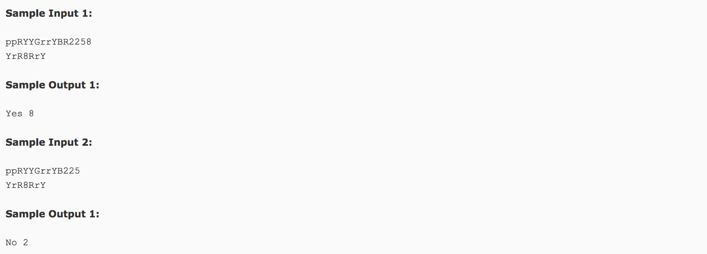

## To Buy or Not to Buy(20)




题意：字符串匹配。给定字符串a和b,在a中寻找b中的字符。如果全部找到，则输出Yes,以及a比b多余的字符个数；否则，则输出No，以及缺少的个数。

分析：利用visit[128]数组存储每个字符出现情况及出现次数。遍历一遍s1得到visit[128]数组情况(+操作)，然后遍历一遍s2更新visit[128]数组(-操作)。最后，遍历visit数组，若每个元素均大于等于零，则说明可以满足条件，若小于零，则不满足，并把不满足的个数求和即可。

c++代码(subond):

```c++
#include <iostream>
#include <string.h>
using namespace std;
string s1, s2;
int visit[128] = {0};
int main() {
  getline(cin, s1);
  getline(cin, s2);
  for(int i = 0; i < s1.length(); i++)
    visit[int(s1[i])]++;
  for(int i = 0; i < s2.length(); i++)
    visit[int(s2[i])]--;
  int count = 0;
  for(int i = 0; i < 128; i++) {
    if(visit[i] < 0) {
      count += visit[i] * (-1);
    }
  }
  if(count == 0)
    printf("Yes %d", s1.length() - s2.length());
  else
    printf("No %d", count);
  return 0;
}
```

### 补充

**break** 和 **continue**

**break** 可用于 **循环** 语句和 **switch** 语句。用于 **循环** 语句时，表示只跳出当前层循环（即，只跳出一层循环体），执行其余循环；用于 **switch** 语句时，表示结束switch语句，执行switch之后的语句。

**continue只能** 用于 **循环** 语句中。其意是 **继续循环**。当程序执行到continue时，程序要回到循环的头部执行下次循环，而忽略continue后面的语句。下例中，B将被忽略。

```c++
for(;;) {
  A;
  continue;
  B;
}
```

c++代码(subond)：

```c++
#include <iostream>
#include <cstring>
using namespace std;
int main() {
  string a, b;
  int lena, lenb;
  cin >> a;
  cin >> b;
  lena = a.length();
  lenb = b.length();
  int count = 0;
  for(int i = 0; i < lenb; i++) {
    for(int j = 0; j < lena; j++) {
      if(b[i] == a[j]) {
        a[j] = '#';
        count++;
        break;
      }
    }
  }
  int result = lenb - count;
  if(result == 0) {
    printf("Yes %d", lena - lenb);
  } else {
    printf("No %d", result);
  }
  return 0;
}
```
