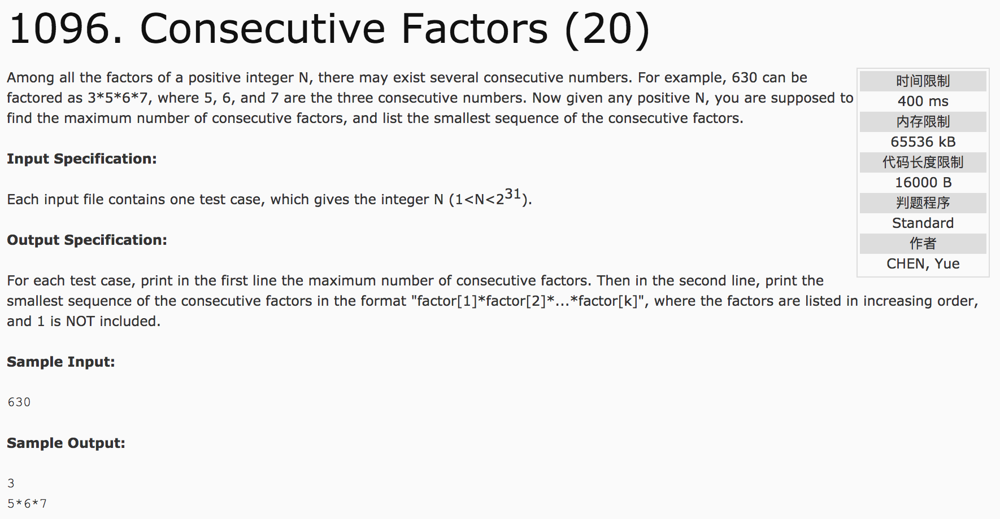

## Consecutive Factors(20)



c++代码：

```c++
#include <cstdio>
#include <cmath>
using namespace std;
int main() {
  int n;
  scanf("%d", &n);
  int max  = sqrt(n * 1.0);
  for(int len = 12; len >= 1; len--) {
    for(int start = 2; start <= max; start++) {
      long long int ans = 1;
      for(int i = start; i - start <= len - 1; i++)
        ans *= i;
      if(n % ans == 0) {
        printf("%d\n%d", len, start);
        for(int i = start + 1; i - start <= len - 1; i++)
          printf("*%d", i);
        return 0;
      }
    }
  }
  printf("1\n%d", n);
  return 0;
}
```
