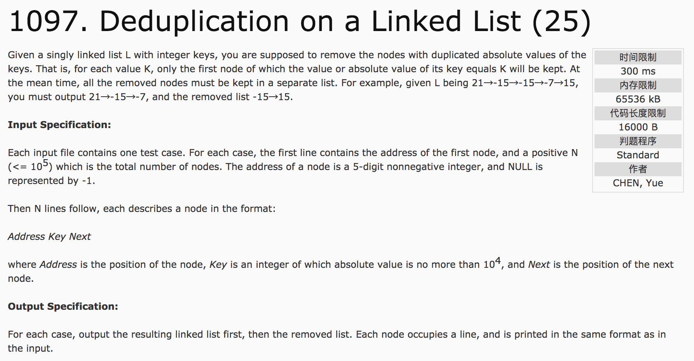
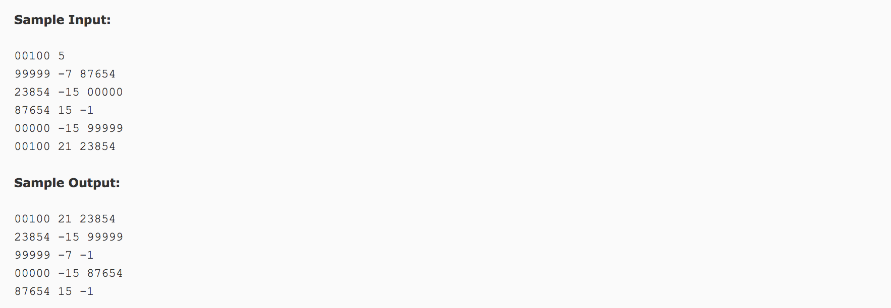

## Deduplication on a Linked List(25)




分析：

1）巧妙之处：利用另外的标志位将数据进行排序，即将符合条件的数据，放在较小的位置，将不符合条件的放在较大的位置。

2）数据并不是完全填充数组，可以将干扰项放在更大的位置上，进行排序后即可成为无效数据。

3）for循环。

```c++
for(int i = start; i != -1; i = v[i].next)
```

c++代码：

```c++
#include <cstdio>
#include <stdlib.h>
#include <algorithm>
using namespace std;
const int maxn = 100000;
struct NODE {
  int addr, key, num, next;
}node[maxn];
bool visit[maxn];
bool cmp1(NODE a, NODE b) {
  return a.num < b.num;
}
int main() {
  int start, n, count1 = 0, count2 = 0, a;
  scanf("%d %d", &start, &n);
  for(int i = 0; i < maxn; i++)
    node[i].num = 2 * maxn;   //保证有效数据均在前面的序列中
  for(int i = 0; i < n; i++) {
    scanf("%d", &a);
    scanf("%d %d", &node[a].key, &node[a].next);
    node[a].addr = a;
  }
  for(int i = start; i != -1; i = node[i].next) {
    if(visit[abs(node[i].key)] == false) {
      visit[abs(node[i].key)] = true;
      node[i].num = count1;
      count1++;
    } else {
      node[i].num = maxn + count2;
      count2++;
    }
  }
  sort(node, node + maxn, cmp1);
  int count = count1 + count2;
  for(int i = 0; i < count; i++) {
    if(i != count1 - 1 && i != count - 1)
      printf("%05d %d %05d\n", node[i].addr, node[i].key, node[i + 1].addr);
    else
      printf("%05d %d -1\n", node[i].addr , node[i].key);
  }
  return 0;
}
```
