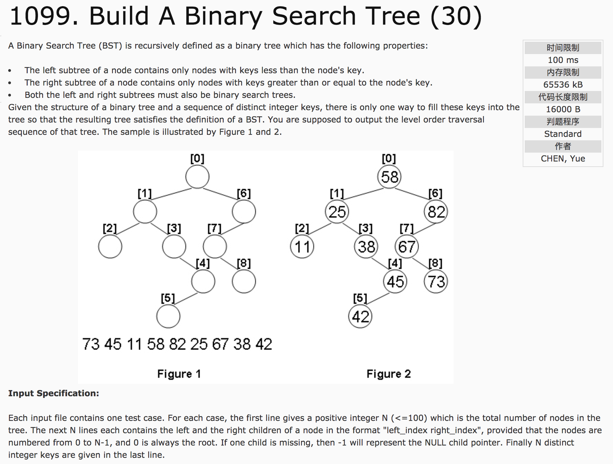
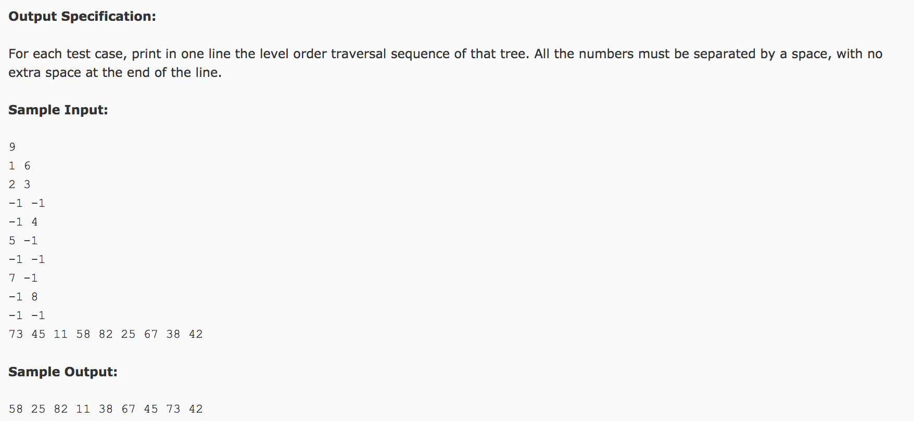

## Build A Binary Search Tree(30)




题意：给定一棵二叉搜索树，包括其左右子孩子情况，规定根节点标号为0，给出插入这棵二叉树的数值，求其插入值后的层序遍历。

分析：1）用结构体TREE(left, right, value)表示这课二叉树。2）因为是二叉搜索树，所以中序遍历得到的节点顺序应该是给出的数值序列从小到大的平列顺序。因此，将数值序列排序，在中序遍历使直接复制即可。3）利用层序遍历输出节点值。

c++代码：

```c++
#include <cstdio>
#include <vector>
#include <algorithm>
#include <queue>
using namespace std;
struct node {
  int left, right, value;
};
vector<node> tree;
vector<int> v;
int t = 0;
void inorder(int root) {
  //依次判断 根 左 右
  if(tree[root].left == -1 && tree[root].right == -1) {
    tree[root].value = v[t++];
    return;
  }
  if(tree[root].left != -1)
    inorder(tree[root].left);
  tree[root].value = v[t++];
  if(tree[root].right != -1)
    inorder(tree[root].right);
}
int main() {
  int n;
  scanf("%d", &n);
  tree.resize(n);
  v.resize(n);
  for(int i = 0; i < n; i++) {
    scanf("%d %d", &tree[i].left, &tree[i].right);
  }
  for(int i = 0; i < n; i++)
    scanf("%d", &v[i]);
  sort(v.begin(), v.end());  //默认升序
  inorder(0);  //中序遍历及赋值
  //对tree进行层序遍历，并输出
  //使用 queue，依次压入每一层的值，并在下次循环时输出
  queue<int> q;
  q.push(0);
  printf("%d", tree[0].value);
  while(!q.empty()) {
    int index = q.front();
    q.pop();
    if(index != 0) printf(" %d", tree[index].value);
    if(tree[index].left != -1) q.push(tree[index].left);
    if(tree[index].right != -1) q.push(tree[index].right);
  }
  return 0;
}

```
