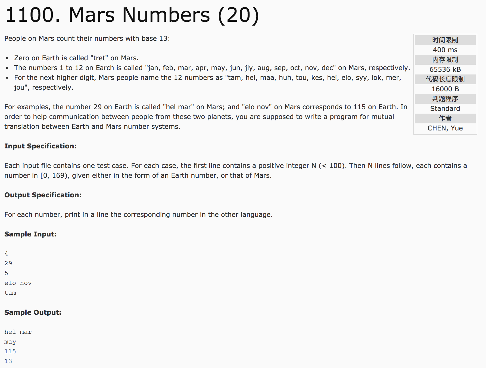

## Mars Numbers(20)



分析：字符串处理。

对输出的内容判断是否为数字。头文件<cctype>, 函数isdigit(s[0])。

c++代码：

```c++
#include <iostream>
#include <string>
#include <cctype>
using namespace std;
string lower[13] = {"tret", "jan", "feb", "mar", "apr", "may", "jun", "jly", "aug", "sep", "oct", "nov", "dec"};
string higher[13] = {"", "tam", "hel", "maa", "huh", "tou", "kes", "hei", "elo", "syy", "lok", "mer", "jou"};
void num2str(string s) {
  int len = s.length();
  int num = 0;
  for(int i = 0; i < len; i++) {
    num = num * 10 + (s[i] - '0');
  }
  cout << higher[num / 13];
  if((num % 13) && (num / 13)) {
    cout << " " << lower[num % 13];
  } else if(num % 13) {
    cout << lower[num % 13];
  } else if(num == 0) {
    cout << lower[num % 13];
  }
}
void str2num(string s) {
  int len = s.length();
  int num = 0;
  if(len == 4) {
    cout << 0;
    return;
  } else if(len == 3) {
    for(int i = 1; i <= 12; i++) {
      if(s == lower[i]) {
        cout << i;
        return;
      }
      if(s == higher[i]) {
        cout << i * 13;
        return;
      }
    }
  } else {
    string temp1 = s.substr(0, 3);
    string temp2 = s.substr(4, 3);
    for(int i = 1; i <= 12; i++) {
      if(temp1 == higher[i])
        num += i * 13;
      if(temp2 == lower[i])
        num += i;
    }
    cout << num;
  }
  return;
}
int main() {
  int n;
  cin >> n;
  getchar();  //回车
  for(int i = 0; i < n; i++) {
    string s;
    getline(cin, s);
    if(isdigit(s[0])) {
      num2str(s);
    } else {
      str2num(s);
    }
    cout << endl;
  }
  return 0;
}
```
