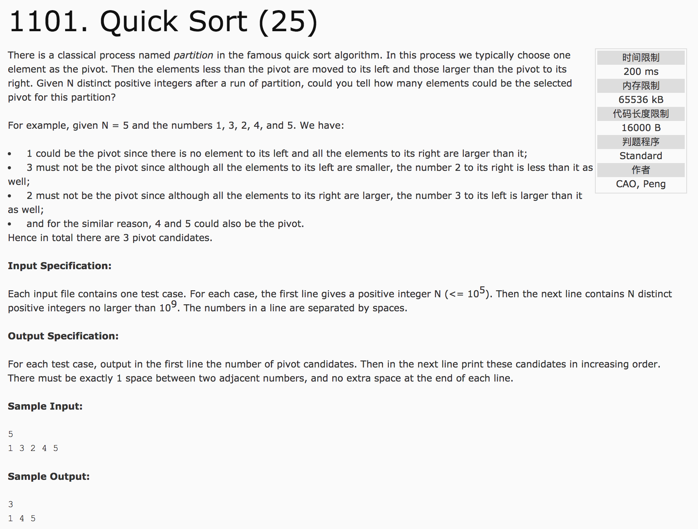

## Quick Sort(25)



题意：快速排序

分析：**从结果的角度考虑，而不是考虑过程**。

pivot值肯定是那些 原序列与有序序列(从小到大)在相同位置上元素值也相同的点，并且 **该值要大于原序列此值前面序列的最大值**。

c++代码：

```c++
#include <cstdio>
#include <vector>
#include <algorithm>
using namespace std;
int a[100010], b[100010];
vector<int> ans;
int main() {
  int n;
  scanf("%d", &n);
  for(int i = 0; i < n; i++) {
    scanf("%d", &a[i]);
    b[i] = a[i];
  }
  sort(a, a + n);
  int temp = -1;
  for(int i = 0; i < n; i++) {
    if(a[i] == b[i] && temp < a[i]) {
      temp = a[i];
      ans.push_back(a[i]);
    }
    if(b[i] > temp)
      temp = b[i];
  }
  printf("%lu\n", ans.size());
  for(int i = 0; i < ans.size(); i++) {
    if(i == 0)
      printf("%d", ans[i]);
    else
      printf(" %d", ans[i]);
  }
  printf("\n");
  return 0;
}
```
