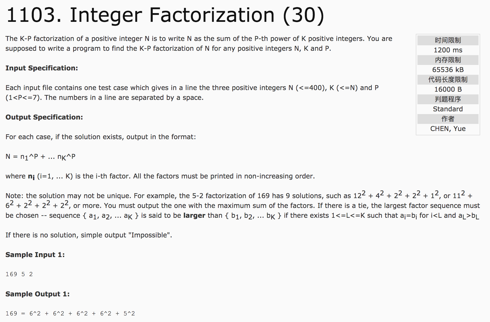
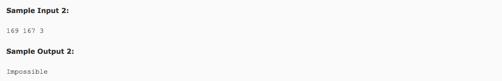

## Integer Factorization(30)




分析：

1）将i的p次方的数，存储在v[i]中，直至v[i] > n;然后进行深度优先搜索。

2)深度优先搜索时，对总和sum,个数k以及各位的和进行判断比较。

```c++
vector<int> v, ans, tempans;
int maxfacsum = -1;
void dfs(int index, int tempsum, int tempk, int facsum) {
  if(tempsum == n && tempk == k) {
    if(facsum > maxfacsum) {
      maxfacsum = facsum;
      ans = tempans;
    }
    return;
  }
  if(tempsum > n || tempk > k) return;
  if(index >= 1) {
    tempans.push_back(index);
    dfs(index, tempsum + v[index], tempk + 1, facsum + index);
    tempans.pop();
    dfs(index - 1, tempsum, tempk, facsum);
  }
}
```

c++代码：

```c++
#include <cstdio>
#include <vector>
#include <algorithm>
using namespace std;
int n, k, p, maxfacsum = -1;
vector<int> v, ans, tempans;
void init() {
  int temp = 0, index = 1;
  while(temp <= n) {
    v.push_back(temp);
    temp = pow(index, p);
    index++;
  }
}
void dfs(int index, int tempsum, int tempk, int facsum) {
  if(tempsum == n && tempk == k) {
    if(maxfacsum < facsum) {
      maxfacsum = facsum;
      ans = tempans;
    }
    return;
  }
  if(tempsum > n || tempk > k) return;
  if(index >= 1) {
    tempans.push_back(index);
    dfs(index, tempsum + v[index], tempk + 1, facsum + index);
    tempans.pop_back();
    dfs(index - 1, tempsum, tempk, facsum);
  }
}
int main() {
  scanf("%d %d %d", &n, &k, &p);
  init();
  dfs(v.size() - 1, 0, 0, 0);
  if(maxfacsum == -1) {
    printf("Impossible\n");
    return 0;
  }
  printf("%d = ", n);
  for(int i = 0; i < ans.size(); i++) {
    if(i != 0)
      printf(" + ");
    printf("%d^%d", ans[i], p);
  }
  return 0;
}
```
