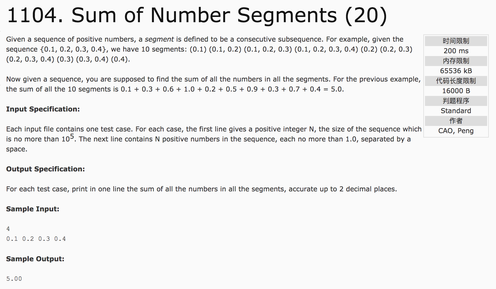

## Sum of Number Segments(20)



题意：计算所有子序列的和，再求总和。

c++代码(subond):

```c++
#include <iostream>
using namespace std;
int main() {
  int n;
  double f[100005];
  scanf("%d", &n);
  for(int i = 1; i <= n; i++)
    cin >> f[i];
  double result = 0.0;
  for(int i = 1; i <= n; i++)
    result += f[i] * i * (n + 1 - i);
  printf("%.2f",result);
  return 0;
}
```
